## Problem & Answer

### 알고 있는 metric에 대해 설명해주세요. (ex. RMSE, MAE, recall, precision ...)

>💡 metric은 크게 Classification metric과 Regression metric으로 나눌 수 있고 Classsification metric에는 Accuracy, F1 등이 있고 Regression metric에는 MSE, MASE 등이 있다

- Classification
    - Accuracy (정확도)
        - 전체중에서 True의 개수
        - 분류기의 성능을 측정할 때 가장 간단히 사용할 수 있음
        - optimize 하기 어려움
        - $TP +TN \over {TP +FP + TN + FN}$
    - Error Rate (오류율)
        - Accuracy의 반대로, 전체 데이터 중에서 잘못 분류한 FP, FN의 비율
        - $FP+FN \over {TP +FP + TN + FN}$
    - Confusion Matrix
        
        
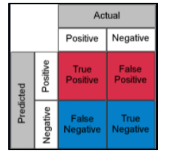

        
        - Positive, Negative는 모델의 예측을 나타는 것
        - True/False는 예측의 정답 여부를 나타내는 것
        - True Positive(TP)는 Positive로 분류하고 맞은(True) 것, True Negative(TN)는 Negative로 분류하고 맞은 것을 나타냄
        - 위에서 표시된 TP, FP, FN, TN을 바탕으로 다양한 Metric을 계산 가능
        
        
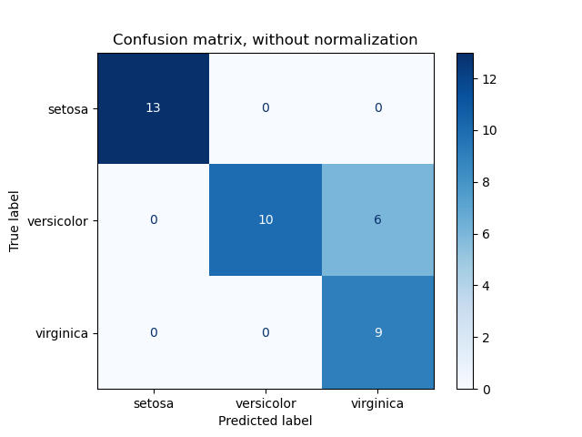

        
        - 다중 클래스에서의 분류 결과에 대한 시각화(대각 성분 = 맞은 예측)
    - Preicision (정밀도)
        - Positive라고 예측한 것중에 맞은(True) 예측
        - $TP \over {TP + FP}$
    - Recall (재현율, 민감도)
        - True labeling Positive였던 것들 중에서 맞은 예측
        - FN는 Negative로 분류했으나  실제로는 Positive 였기 때문에 틀려서 FN이 된 것
        - $TP \over {TP + FN}$
    - Fall-Out
        - 실제로는 Negative인데 모델이 Positive로 오탐한 비율
        - $FP \over {FP + TN}$
    - F1 Score
        - 정밀도와 재현율의 관계는 trade-off이므로 정밀도와 재현율의 조화 평균을 metric으로 활용한 것이 F1 score이다.
        - Precision은 모두 Positive로 분류하면 100%가 되기 때문에 Recall과의 조화평균을 통해 성능을 평가하는 지표
        - $2\over{{1\over Recall}+{1\over Precision}}$
    - Area Under the Receiver Operating Characteristic Curve (ROC AUC)
        - ROC : 분류 모델의 성능을 보여주는 그래프
        - AUC : 곡선 아래 영역
        - Fall out과 Recall을 통해 FPR, TPR을 X,Y축으로 두고 Threshold를 변경시키면서 그린 곡선을 ROC라고 한다
        - TPR : Sensitivity($TP\over{TP+FN}$) : 민감도, 재현율
        - FPR : specificity($FP\over{FP+TN}$) : 특이도
        - 이 때, ROC를 수치화 할 수 있는 방법이 딱히 없으므로, Area Under Curve라는 곡선 밑 부분의 넓이 값을 통해 성능을 측정한다.
        - Recall이 높고, Fall Out은 낮을 수록 넓이가 1에 가까워져 좋은 모델이 된다.
        - 이중 분류에만 사용
        - 특정 threshold를 설정
        - 예측의 순서에 의존적이며 절대값엔 의존적이지 않음
    
    
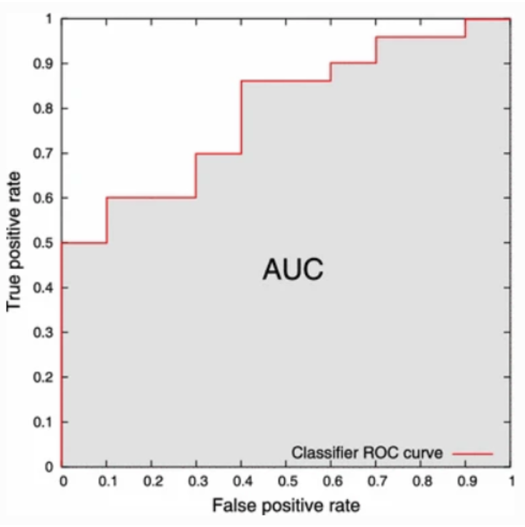 

    
    - Precision Recall Curve
        - confidence 레벨에 대한 threshold 값의 변화에 따라 계산된 Precision 및 Recall을 그래프로 시각화한 것
        
        
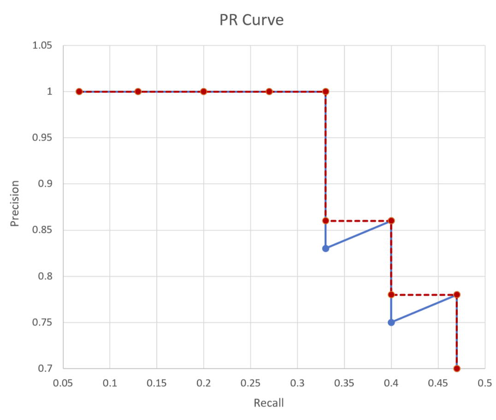

        
        - 데이터 라벨의 분포가 심하게 불균등 할때 ROC 그래프보다 분석에 유리함
        - X축은 Recall 값을, Y축은 Precision 값을 사용
        - Base line= P / (P+N)을 기준으로 위에 위치할수록 좋은 모델
            - 따라서 아래의 경우에 A 모델이 더 좋은 모델임
            
            
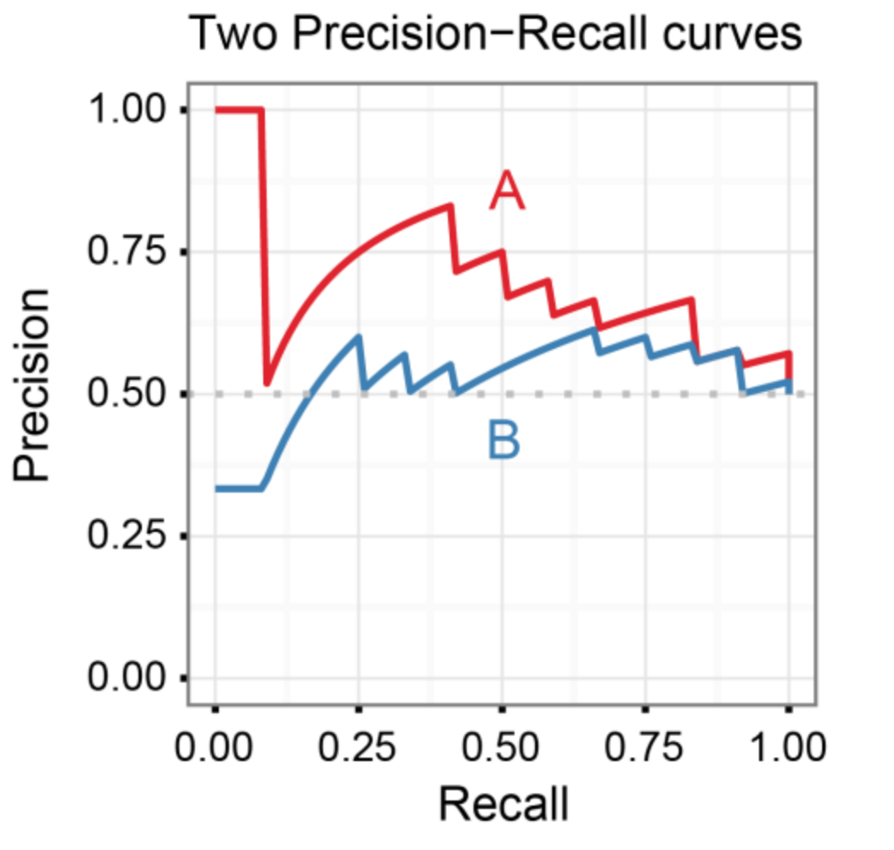

            
        - F-Beta Score
            - F1 score에서 Recall에 가중치를 주어서 평가하는 Metric ($\beta$가 1인 경우 F1 score와 동일)
        - Average Precision
            - 정량적 평가를 위해 PR Curve의 아래 영역을 계산한 것
        - Recall At Fixed Precision
            - Precision threshold가 주어졌을 때  가장 큰 recall 값을 구하는 것
    - KL Divergence
        - 두 확률 분포의 차이를 수치로 표현한 것
    - Logloss
        - 잘못된 답변에 대해 더 강하게 패널티 부여
    - Hamming Distance
        - 두 길이가 같은 문자열 사이의 거리를 측정(몇개의 문자를 바꿔야 같아지는가?)
    - Jaccard index
        - 두 집합이 공통적으로 가진 것을 기반으로 하는 비유사성 측도
    - Label Ranking Average Precision
        - 멀티 레이블인 경우에 사용하는 AP
    - Label Ranking Loss
        - 멀티 레이블인 경우 사용하는 Loss
- Regression
    - Cosine Similarity
        - 유사도 측정
        $similarity = cos(\theta) = {{A \cdot B}\over \parallel A\parallel \parallel B\parallel}$
    - Explained Variance
        - $1- {{Sum\,of\,Squared\,Residuals - Mean\,Error}\over Total\,Variance}$
    - MAE (Mean Absolute Error)
        - 모델의 예측값과 실제값의 차이를 모두 더한 오차 절대값의 평균
        - MSE와 다르게 오차가 커도 큰 불이익을 주지 않는다.
        - Outlier의 영향을 받지 않음
    - MAPE (Mean Absolute Percentage Error)
        - MAE를 percent로 변환한 weight 버전
    - MSE (Mean Squared Error)
        - 실제 값과 예측 값 차이의 면적의 합
        - 오차를 제곱한 뒤 평균하여 산출
    - MSPE (Mean Squared Percentage Error)
        - MSE를 percent로 변환한 weight 버전
    - RMSE (Root Mean Squared Error)
        - 평균 오차 제곱합(MSE)에 루트를 씌워 오차율을 보정해줌
        - 회귀 metric으로 많이 사용됨
    - Mean Squared Log Error
        - 예측 값과 GT에 로그를 취한 뒤 차를 더한 것의 평균
    - R2 Score (R-squared, 결정계수)
        - $1- {{Sum\,of\,Squared\,Residuals}\over Total\,Variance}$
        - 총제곱합(SST)에 대한 회귀제곱합(SSR)을 뜻하며 결정계수라고도 불림
        - 결정계수는 반응변수의 변동량(분산)에서 현재 적용모델이 설명할 수 있는 부분의 비율을 뜻함
        - 예측의 적합도를 0과 1 사이의 값으로 계산하고, 1에 가까울 수록 설명력이 높다고 말함
    - RMSLE (Root Mean Squared Logarithmic Error)
        - RMSE에 비해 아웃라이어에 강건해짐
        - 상대적 Error를 측정할 수 있음
        - Under Estimation(예측값 < 실제값)에 큰 페널티를 부여
    - Pearson Correlation Coefficient
        - 두 변수 간의 선형 상관 관계를 계량화한 것
    - Spearman Correlation Coefficient
        - 두 변수 간의 단조적 상관 관계를 계량화한 것
    - SMAPE (Symmetric Mean Absolute Percentage Error)
        - $SMAPE = {100 \over n}  \times \displaystyle \sum^n_{i=1} {\lvert Y_i-\hat Y_i\rvert \over(\lvert Y_i\rvert + \lvert \hat Y_i\rvert) /2}$
    
#### Reference

- [[ML] Metric 종류](https://wooono.tistory.com/99)
- [TorchMetrics](https://torchmetrics.readthedocs.io/en/stable/all-metrics.html)
- [mAP 정리](https://ctkim.tistory.com/79)
- [분류모델의 성능 평가](https://bcho.tistory.com/1206#recentEntrie)
- [[ML 이론] EVALUATION METRIC 정리](https://cryptosalamander.tistory.com/177)
- [Introduction to the precision-recall plot](https://classeval.wordpress.com/introduction/introduction-to-the-precision-recall-plot/)

---

### Local Minima와 Global Minimum에 대해 설명해주세요.

>💡 Gradient Descent 방법을 활용하여 Cost Function의 최솟값을 찾게 되는데 기울기가 0이 되는 점이 여러 개 존재할 수 있다.  
Local Minima(극소값)은 주위의 모든 점의 함숫값 이하의 함숫값을 갖는 점의 함숫값이다.  
Global Minimum(최솟값)은 정의역(x가 될 수 있는 범위)의 모든 점에서의 최소점의 함숫값을 의미한다.

- **Example**
   
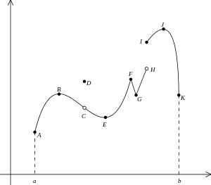

    - Global Minimum(최솟값)은 항상 Local Minima(극소값)이다. 
    - 하지만 Local Minima(극소값)이 항상 Global Minimum(최솟값)이 되는 것은 아니다. 
    - 아래 그림에서 A는 Global Minimum(최솟값)이고 E, G는 Local Minima(극소값)이다. 

#### Reference
- [위키피디아 - 극값](https://ko.wikipedia.org/wiki/%EA%B7%B9%EA%B0%92)
- [Local Minima와 Global Minima에 대하여 설명해주세요](https://velog.io/@lswkim/Local-Minima%EC%99%80-Global-Minima%EC%97%90-%EB%8C%80%ED%95%B4-%EC%84%A4%EB%AA%85%ED%95%B4%EC%A3%BC%EC%84%B8%EC%9A%94)
- [Maxima vs Minima and Global vs Local in Machine learning - Basic Concept](https://medium.com/@dilip.voleti/maxima-vs-minima-and-global-vs-local-in-machine-learning-basic-concept-741e760e9f80)

---

### 차원의 저주에 대해 설명해주세요.
>💡 데이터를 잘 표현하는 예측 모델을 만들기 위해서는 다양한 차원이 필요합니다. 하지만 이런 차원이 증가할 수록 모델의 성능이 떨어지는 현상을 차원의 저주라고 일컫습니다.  이런 현상이 발생하는 이유는 차원이 증가함에 따라 더 많은 차원을 표현할 수 있는 데이터가 필요해지고 기존 데이터로는 개별 차원마다 원활한 학습이 이루어지지 않기 때문입니다.

- 차원은 높은데 적은 데이터 수를 가지고 모델을 학습시키게 되면 이 모델은 과대적합된 모델이 된다. 그 이유는 차원이 높아 그만큼 데이터를 설정하는 변수의 수가 많지만 데이터의 수는 적기 때문에 실제 데이터 차원에 해당 되는 공간의 많은 경우들을 확인할 수 없기 때문에 모델이 학습 데이터에 과적합된 학습을 하여 성능이 낮아진다.

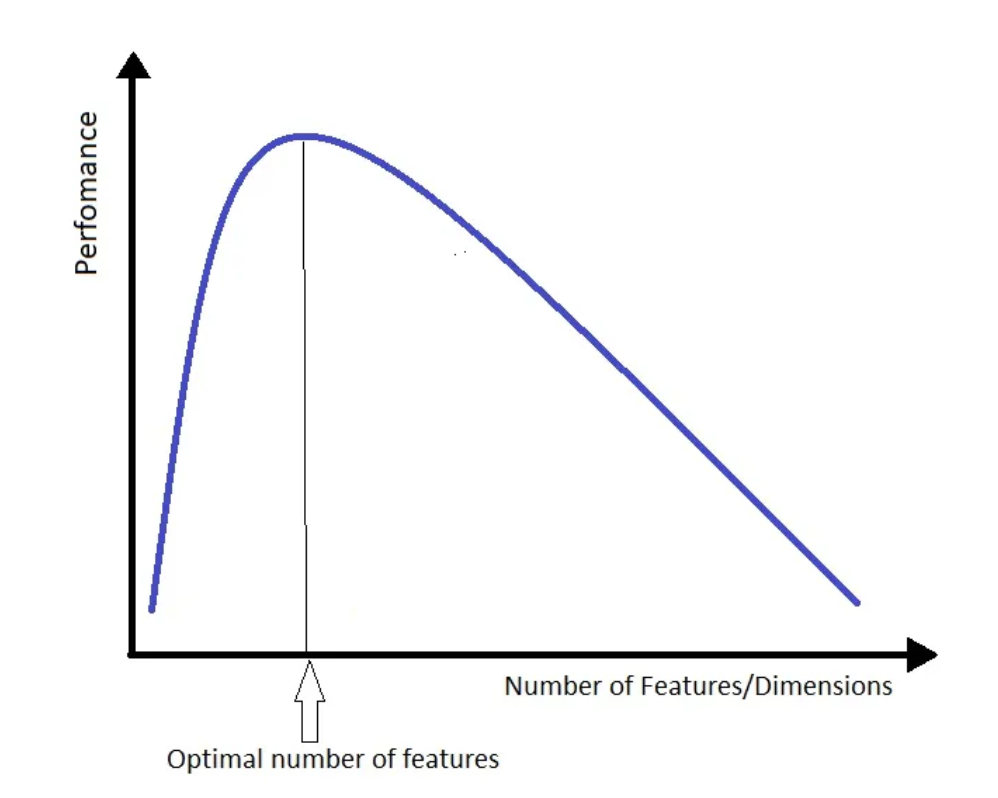

- 차원의 저주(Curse of dimensionality) 현상은 수치 분석, 샘플링, 조합, 기계 학습, 데이터 마이닝 및 데이터베이스와 같은 영역에서 발생한다. 이러한 문제의 공통 주제는 차원이 증가하면 공간의 부피가 너무 빨리 증가하여 사용 가능한 데이터가 희소해진다는 것이다. 신뢰할 수 있는 결과를 얻기 위해 필요한 데이터의 양이 차원에 따라 기하급수적으로 증가하는 경우가 많다. 
    - 차원 = 변수의 수 = 축의 수
        - 차원이 늘어난다 = 변수의 수가 많아진다 = 축의 개수가 많아진다 = 데이터의 공간이 커진다
    - 1차원 공간에서의 1,000개의 데이터가 존재할 때, 1,000개 정도의 데이터만 있어도 빈 곳이 없다.

    
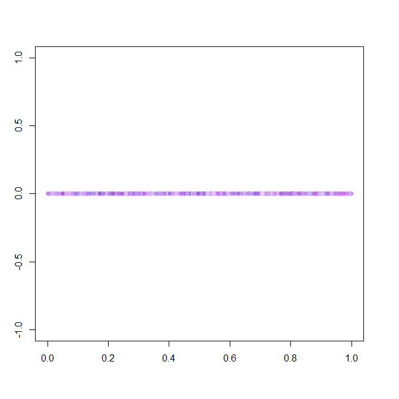

    - 2차원 영역을 다 채우기 위해서는 20,000개의 데이터가 필요
    
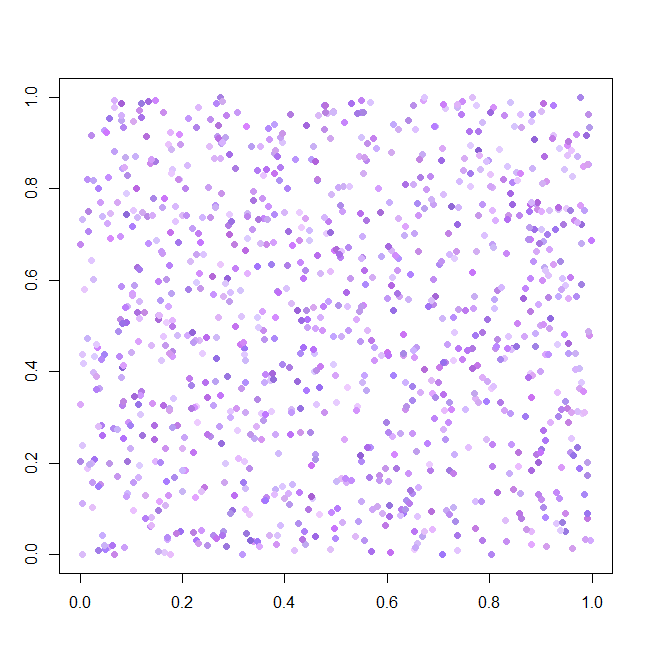 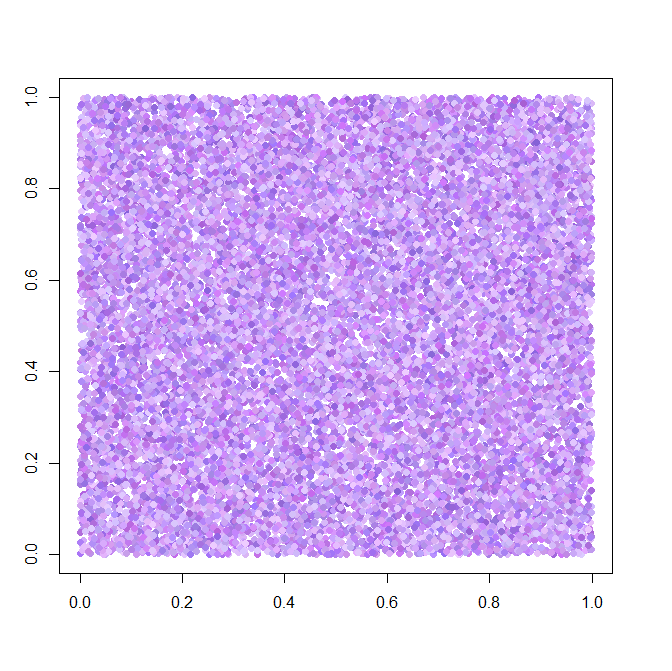

    - 3차원 영역을 다 채우기 위해서는 100,000개의 데이터가 필요
    
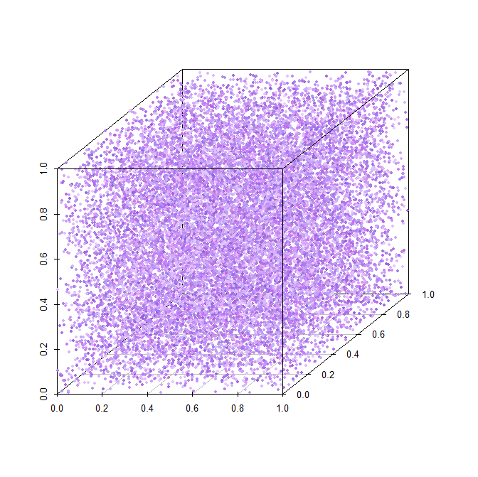 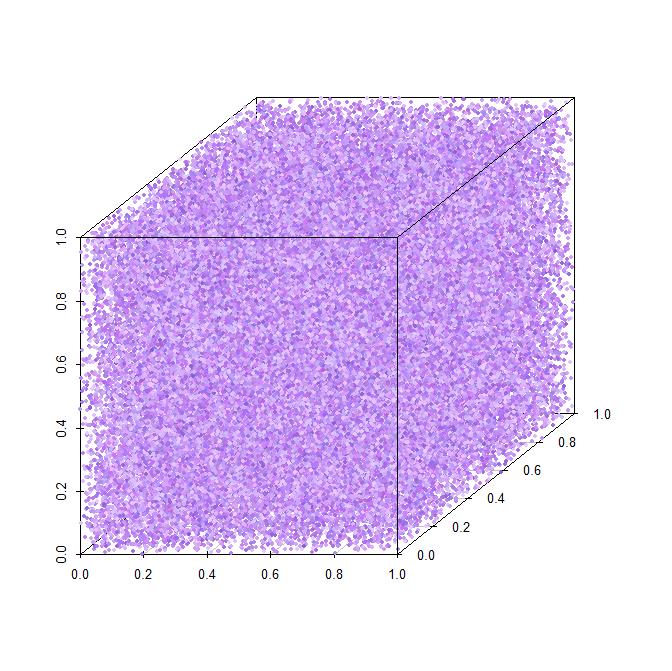

- 차원의 저주 해결방법

    - 데이터 추가 수집
    - 공간 벡터의 거리를 측정할 때 Euclidean distance 대신 Cosine Similarity 활용
    - 차원 줄이기
        - Forward-feature selection
        - PCA/t-SNE

#### Reference
- [차원의 저주(Curse of dimensionality)란? - 자윰이의 성장일기](https://think-tech.tistory.com/9)
- [[빅데이터] 차원의 저주(The curse of dimensionality)](https://think-tech.tistory.com/9)
- [Curse of Dimensionality - A “Curse” to Machine Learning](https://towardsdatascience.com/curse-of-dimensionality-a-curse-to-machine-learning-c122ee33bfeb)
- [차원의 저주](https://oi.readthedocs.io/en/latest/ml/curse_of_dimensionality.html)

---

### dimension reduction기법으로 보통 어떤 것들이 있나요?

>💡 **Dimension reduction**은 **Feature extraction**, **Feature selection** 두 가지로 나눌 수 있습니다.
>
>**Feature selection**의 **장점**은 선택한 피처의 해석이 용이하다는 점이고 **단점**은 피처간 상관관계를 고려하기 어렵다는 점입니다. filter, wrapper, embedded methods와 같은 방법들이 해당됩니다.
>
>**Feature extraction**의 **장점**은 피처 간 상관관계를 고려하기 용이하고 피처의 개수를 많이 줄일 수 있다는 점이고 **단점**은 추출된 변수의 해석이 어렵다는 점입니다. 이러한 **Feature extraction**은 Linear, Non-Linear로 다시 나뉩니다.

Feature selection

- Filter
    - 통계를 기반으로 greedy하게 차원을 축소하는 방법입니다. 예를 들어 대상과의 상관관계가 기준이 될 수 있습니다. 이 방법은 가장 빠르고 간단한 방법입니다.
- Embedded
    - 예측 알고리즘의 일부입니다. 예를 들어, 트리 기반 알고리즘은 본질적으로 데이터 세트 기능에 점수를 매기고 중요도에 따라 순위를 매깁니다. Lasso L1 정규화는 본질적으로 가중치를 0으로 떨어뜨림으로써 중복 기능을 제거합니다.
- Wrapper
    - 가장 유용한 기능을 식별하기 위해 기능의 하위 집합이 있는 Validation set에서 예측 알고리즘을 사용합니다. 최적의 하위 집합을 찾는 데에 많은 계산 비용이 요구됩니다. 래퍼 방법은 역방향/전방향 선택과 같은 탐욕적인 결정을 내립니다. 이 선택은 피쳐를 차례로 탐욕스럽게 제거/선택합니다.

Feature Projection

- Linear
    - Original Feature를 선형으로 결합하여 Original data set을 더 적은 차원으로 압축합니다. 일반적인 방법에는 주성분 분석(PCA), 선형 판별 분석(LDA) 및 특이값 분해(SVD)가 포함됩니다.
- Non-Linear
    - 좀더 복잡하지만 Linear method로는 해결하기 힘들 때 유용한 차원 감소를 찾을 수 있습니다. 비선형 차원 감소 방법에는 커널 PCA, t-SNE, Autoencoders, Self-Organizing Maps, IsoMap 및 UMap이 포함됩니다.

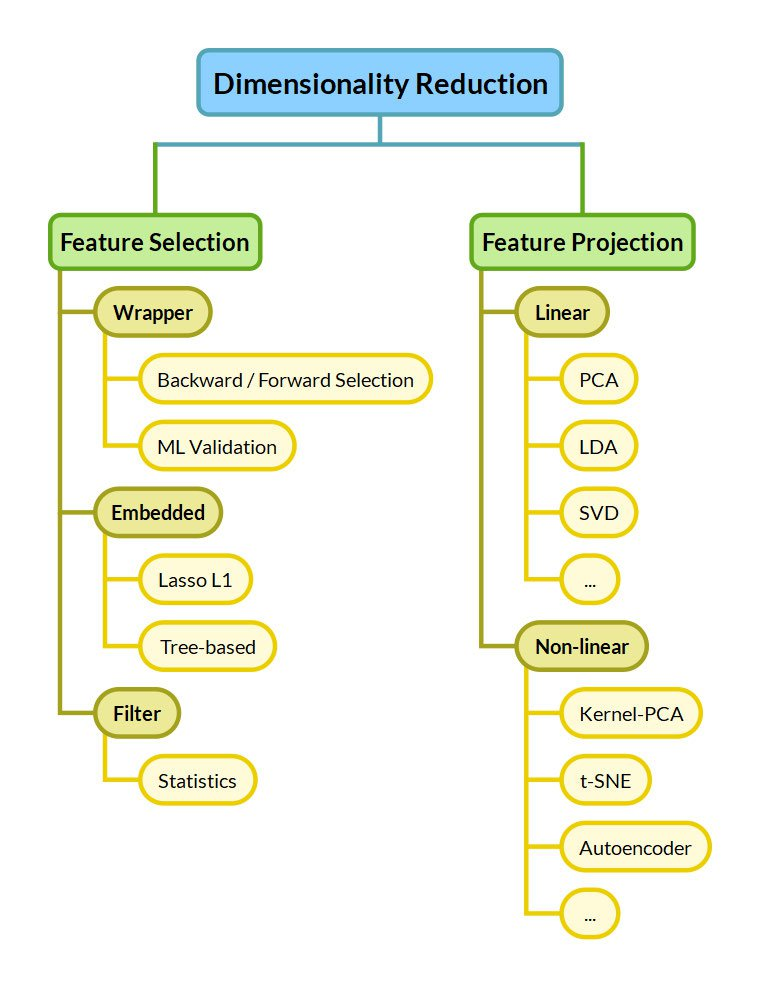

#### Reference
- [11 Dimensionality reduction techniques you should know in 2021](https://towardsdatascience.com/11-dimensionality-reduction-techniques-you-should-know-in-2021-dcb9500d388b)
- [What Is Dimensionality Reduction? Meaning, Techniques, and Examples](https://www.spiceworks.com/tech/artificial-intelligence/articles/what-is-dimensionality-reduction/)
- [Applied Dimensionality Reduction — 3 Techniques using Python](https://www.learndatasci.com/tutorials/applied-dimensionality-reduction-techniques-using-python/)

---

### PCA는 차원 축소 기법이면서, 데이터 압축 기법이기도 하고, 노이즈 제거기법이기도 합니다. 왜 그런지 설명해주실 수 있나요?

>💡 PCA(Principal Component Analysis, 주성분 분석)의 기본 개념은 주어진 벡터에서 선형 독립인 고유 벡터만을 남겨두고 차원 축소를 하고. 이때 상관성이 높은 독립 변수들을 N개의 선형 조합으로 만들어 변수의 개수를 요약, 압축하는 방법입니다.
>
>사영 후 원데이터의 분산을 최대한 보전할 수 있는 기저를 찾아 차원을 줄이므로 차원 축소 기법이며 그 결과 feature들의 수가 기존보다 작아지기 때문에 데이터 압축 기법입니다. PCA 이후 정보 설명력이 높은 주성분들만 선택하고 정보 설명력이 낮은, 노이즈로 구성된 변수들은 배제하기 때문에 노이즈 제거 기법이기도 합니다. (**노이즈를 완전 제거하지는 못함!**)

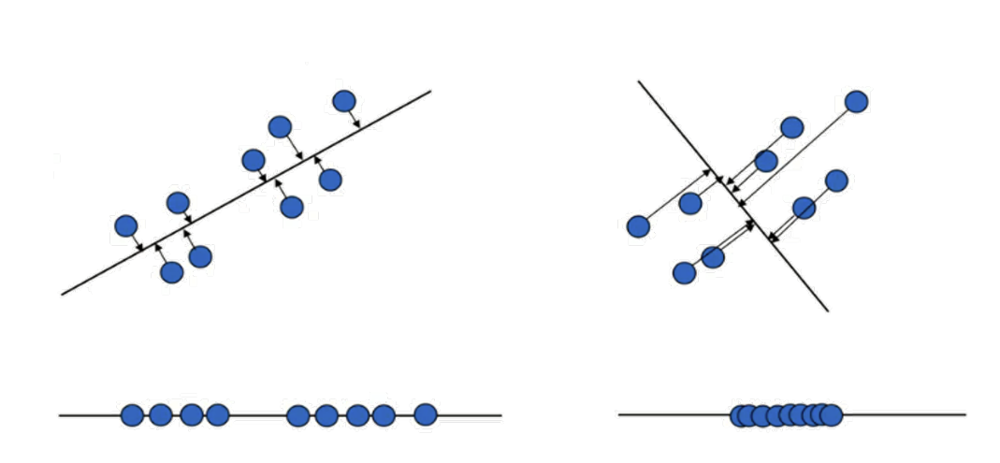

#### Reference
- [[선형대수학 #6] 주성분분석(PCA)의 이해와 활용](https://darkpgmr.tistory.com/110)
- [[Machine learning] 차원축소, PCA, SVD, LSA, LDA, MF 간단정리 (day1 / 201009)](https://huidea.tistory.com/126)

---

### LSA, LDA, SVD 등의 약자들이 어떤 뜻이고 서로 어떤 관계를 가지는지 설명할 수 있나요?

>💡 **SVD**는 **Singular Value Decomposition**(특이값분해)의 약자로 행렬의 크기와 관계 없이 모든 m x n 행렬에 대해 적용 가능한 행렬 분해 방법입니다. 행렬 A가 m x n 행렬일 때 $A = U\Sigma V^T$ 로 분해할 수 있습니다. 또한, SVD로 나온 대각행렬의 대각 원소 값을 행렬 A의 특이값(singular value)이라고 합니다.
>
>**LSA**는 **Latent Semantic Analysis**(잠재의미분석)의 약자로 SVD를 활용해 문서에 함축된 주제를 찾아내는 것을 의미합니다. BoW에 기반한 DTM, TF-IDF 행렬에 truncated SVD를 사용하여 차원을 축소시키고, 단어들의 잠재적인 의미를 끌어낸다는 아이디어입니다.  또한 LSI(Latent Semantic Indexing)로 표현하기도 합니다. 
>
>**LDA**는 **Latent Dirichlet Allocation**(잠재 디리클레 할당)과 **Linear Discriminant Analysis**(선형판별분석) 두 가지 개념의 약자가 될 수 있습니다.
>
>**Latent Dirichlet Allocation**(잠재 디리클레 할당)은 주어진 문서에 대하여 각 문서에 어떤 주제들이 존재하는지를 서술하는 것에 대한 확률적 토픽 모델 기법중 대표적인 알고리즘입니다. LDA 역시 BoW에 기반한 DTM, TF-IDF 행렬을 입력으로 하고, 단어가 특정 토픽에 존재할 확률과 문서에 특정 토픽이 존재할 확률을 결합확률로 추정하여 토픽을 추출합니다.
>
>**Linear Discriminant Analysis**(선형판별분석)은 Classification(분류모델)과 Dimensional Reduction(차원 축소)까지 동시에 사용하는 알고리즘입니다. 입력 데이터 세트를 저차원 공간으로 투영(projection)해 차원을 축소하는 기법이며 지도학습에서 사용됩니다. LDA 또는 FDA(Fisher Discriminant Analysis, 선형판별분석)으로도 표현합니다.
>
>LSA(Latent Semantic Analysis) 및 LDA(Latent Dirichlet Allocation) 둘 다 truncated SVD를 활용한 차원 축소를 통해 잠재 의미를 찾고자 합니다.
단, LDA의 경우 LSA에서 파생된 확률 모델인 pLSA가 가진 문헌별 주제 분포를 파악하지 못하는 점을 개선하기 위해 다변수 확률변수인 디리클레 분포를 활용하여 문헌별 주제 + 주제별 단어분포를 고려합니다.

- $A: m\times n$ rectangular matrix (직사각 행렬)
- $U:m \times m$ orthogonal matrix (직교 행렬)
- $\Sigma:m\times n$ diagonal matrix (대각 행렬)
- $V: n\times n$ orthogonal matrix (직교 행렬)
- BoW(Back of Words): 단어 빈도 수
- DTM(Document-Term Matrix): 문서 단어 행렬
- TF-IDF(Term Freqeuncy-Inverse Document Frequency): DTM에 단어의 중요도를 가중치로 부여
- 디리클레 분포

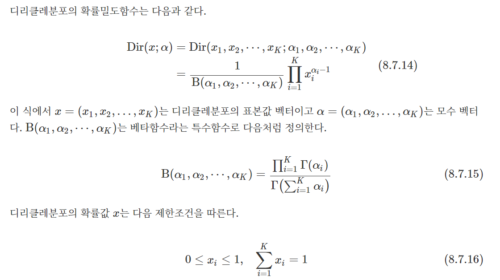

#### Reference
- [잠재 의미 분석(Latent Semantic Analysis, LSA) - 딥 러닝을 이용한 자연어 처리 입문](https://wikidocs.net/24949)
- [잠재 디리클레 할당(Latent Dirichlet Allocation, LDA) - 딥 러닝을 이용한 자연어 처리 입문](https://wikidocs.net/30708)
- [특이값 분해(SVD) - 공돌이의 수학정리노트](https://angeloyeo.github.io/2019/08/01/SVD.html)
- [[토픽 모델링] LSA와 LDA의 관계(+ LDA라는 이름의 유래)](https://bab2min.tistory.com/585)
- [8.7 베타분포, 감마분포, 디리클레분포](https://datascienceschool.net/02%20mathematics/08.07%20%EB%B2%A0%ED%83%80%EB%B6%84%ED%8F%AC%2C%20%EA%B0%90%EB%A7%88%EB%B6%84%ED%8F%AC%2C%20%EB%94%94%EB%A6%AC%ED%81%B4%EB%A0%88%20%EB%B6%84%ED%8F%AC.html)
- [머신러닝 - LDA (Linear Discriminant Analysis)](https://velog.io/@swan9405/LDA-Linear-Discriminant-Analysis)
- [[인공지능] Fisher Discriminant Analysis(선형판별분석)](https://knowable.tistory.com/41)
- [NLP - 9. 토픽 모델링: 잠재 의미 분석(LSA)](https://bkshin.tistory.com/entry/NLP-9-%EC%BD%94%EC%82%AC%EC%9D%B8-%EC%9C%A0%EC%82%AC%EB%8F%84%EB%A5%BC-%ED%99%9C%EC%9A%A9%ED%95%9C-%EC%98%81%ED%99%94-%EC%B6%94%EC%B2%9C-%EC%8B%9C%EC%8A%A4%ED%85%9C)
- [위키백과 - 잠재 디리클레 할당](https://ko.wikipedia.org/wiki/%EC%9E%A0%EC%9E%AC_%EB%94%94%EB%A6%AC%ED%81%B4%EB%A0%88_%ED%95%A0%EB%8B%B9)

---

### Markov Chain을 고등학생에게 설명하려면 어떤 방식이 제일 좋을까요?

>💡 Markov Chain은 이산적인 시간에 따라 시스템이 어떤 상태에서 다른 상태로 넘어가거나 같은 상태를 유지할 때, 상태 변화의 확률 과정은 바로 전 단계의 상태, 혹은 그 이전 일정 기간의 상태에만 영향을 받는 것을 의미합니다. 
>
>예를 들어, ‘사람들은 전날 먹은 음식과 유사한 음식을 먹지 않으려고 한다.’ 라는 가정에서 오늘의 음식 선택이 어제의 음식 선택에만 영향을 받고, 그저께의 음식 선택에는 영향을 받지 않는다면 이 과정은 Markov property를 가진다고 할 수 있으며, 이 확률 과정은 Markov chain이라고 할 수 있습니다.
>
>또한, 어제의 음식에만 영향을 받는다면 1차 Markov chain, 그저께까지의 음식 선택에만 영향을 받는다면 2차 Markov chain입니다.
>
>다른 예로는 한 대학원생의 활동 사이클을 시스템으로 표현하면 아래 그림과 같습니다. 이때 웹서핑을 한 후에 다시 웹서핑을 할 확률은 0.3, 연구를 할 확률은 0.5, 독서를 할 확률은 0.2입니다. 메모리가 1인 1차 Markov chain이라면 현재 자신의 상태밖에 기억하지 못하기 때문에 웹서핑을 한 상태에서는 전에 웹서핑을 몇 번을 했든지 다음 상태로의 확률은 언제나 웹서핑은 0.3, 연구는 0.5, 독서는 0.2가 됩니다.
>
>하지만 현재 웹서핑 마치고 다음 상태로 넘어갈 때 현재 웹서핑 이전에 또 웹서핑을 해서 죄책감으로 다시 웹서핑을 할 확률이 0.1 줄어들어 웹서핑 0.2 연구 0.6 독서 0.2가 되거나 직전에 연구를 하고 웹서핑을 하여 쉬고 싶은 마음에 연구 확률이 0.1 줄어 다음 상태 확률이 웹서핑 0.4 연구 0.4 독서 0.3가 되는 것을 메모리가 2인 2차 Markov chain 이라고 하고 이것은 이전 상태가 현재 상태에 영향을 준다고 할 수 있습니다.
>
>이렇게 이전 상태의 기억을 오래 기억할수록 3차, 4차 Markov chain이 됩니다.
>
>이러한 Markov Chain은 MCMC(Markov Chain Monte Carlo sampling)에 활용됩니다.

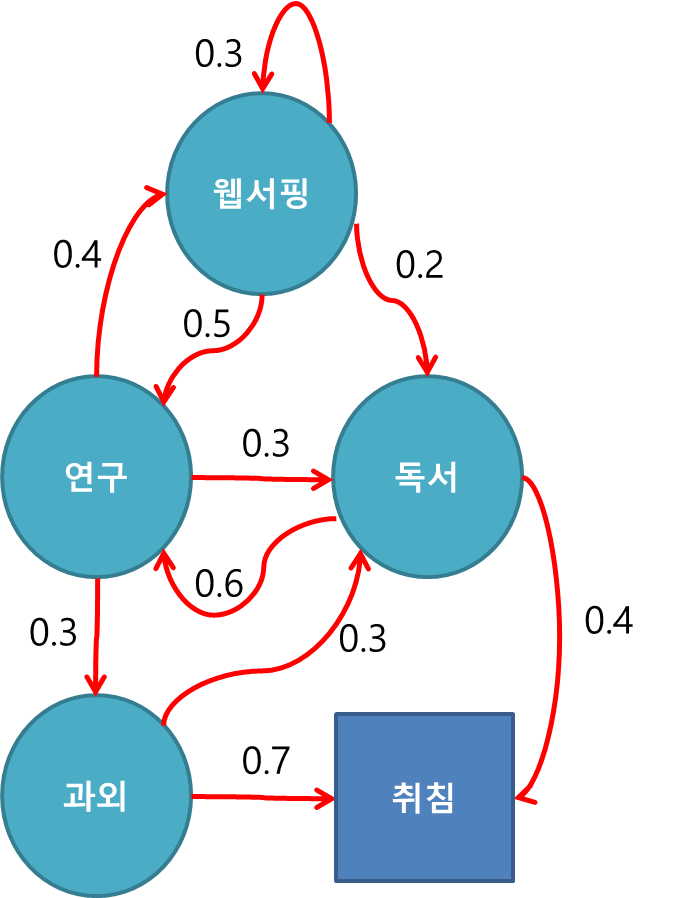

- MCMC
    - Markov Chain을 이용한 Monte Carlo 방법으로 이전의 샘플 추출이 다음 샘플 추출에 영향을 미침
    - Markov chain은 연쇄를 반복하다 보면 현재 상태의 확률이 직전 상태의 확률과 수렴
    - 평형 상태에 도달한 확률 분포를 정적 분포(Stationary Distribution)이라고 함
    - 이러한 정적 분포가 목표 분포(target distribution) p(x)가 되도록 Markov chain을 설정하는 것이 MCMC 접근법

#### Reference
- [Markov Chain Monte Carlo - 공돌이의 수학정리노트](https://angeloyeo.github.io/2020/09/17/MCMC.html)
- [Markov Chain - MLWiki](https://sites.google.com/site/machlearnwiki/RBM/markov-chain)
- [[Machine learning] Markov Chain, Gibbs Sampling, 마르코프 체인, 깁스 샘플링 (day2 / 201010)](https://huidea.tistory.com/128?category=879541)
- [Markov Chain Explained](https://builtin.com/machine-learning/markov-chain)
- [[강화학습] 마코프 프로세스(=마코프 체인) 제대로 이해하기](https://bskyvision.com/entry/%EB%A7%88%EC%BD%94%ED%94%84-%ED%94%84%EB%A1%9C%EC%84%B8%EC%8A%A4%EB%A7%88%EC%BD%94%ED%94%84-%EC%B2%B4%EC%9D%B8%EB%9E%80)
- [wikipedia - 마르코프_연쇄](https://ko.wikipedia.org/wiki/%EB%A7%88%EB%A5%B4%EC%BD%94%ED%94%84_%EC%97%B0%EC%87%84)

---

### 텍스트 더미에서 주제를 추출해야 합니다. 어떤 방식으로 접근해 나가시겠나요?

>💡 텍스트 데이터 내 단어들의 빈도를 통계적으로 분석하여 전체 데이터를 관통하는 잠재적 주제, 즉 토픽들을 자동으로 추출 분류할 수 있습니다. 이러한 방법론을 Topic Modeling이라고 합니다. Topic Modeling에는 Latent Semantic Analysis (LSA), Probabilistic LSA(pLSA), Latent Dirichlet Allocation(LDA), Correlated topic model(CTM), Structural topic model(STM) 등이 있습니다.

- Latent Semantic Analysis(LSA, 비확률적 토픽 분석)
    - Latent Semantic Indexing(LSI) 라고도 불리며, SVD(특이값 분해)를 활용해 문서에 함축된 주제를 찾아내는 것을 의미합니다
    - LSA의 단점으로는 데이터에 내재된 오차를 컨트롤할 수 없고 의미공간의 가중치가 음수인 경우가 발생하여 해석이 어렵습니다
- Probabilistic LSA(pLSA, 확률적 토픽 분석)
    - pLSA는 단어가 등장 횟수 기반이 아닌 등장 확률을 기반으로 분석하는 방법입니다
    - 단점으로는 LSA와 같이 단순하게 문헌-용어 행렬만 입력받기 때문에 문헌 내에 주제가 어떻게 분포하는가는 고려하지 않습니다
- Latent Dirichlet Allocation(LDA, 잠재 디리클레 할당)
    - LDA는 pLSA의 Bayesian 버전으로 토픽에 대한 사전확률분포로 Dirichlet prior를 이용합니다
    - LDA는 pLSA의 단점을 보완하기 위해 문헌별 주제 분포와 주제별 단어 분포를 고려합니다
    - LDA의 단점으로는 문서에 대한 토픽분포의 모수(토픽비율)를 디리클레분포로 생성하여 토픽간 연관성을 반영하지 못합니다
- Correlated topic model(CTM, 상관 토픽 모델)
    - CTM은 LDA의 확장 버전으로 토픽간 연관성을 나타내는 토픽비율을 다변량정규분포를 이용하여 2단계로 모형화 합니다
- Structural topic model(STM, 구조 토픽 모델)
    - STM은 LDA에서 토픽간의 연관성을 반영하지 못하는 단점을 보완하기 위한 방법입니다.
    - STM은 관계 추정이 가능한 로지스틱 정규분포를 사용하게 됩니다.
    - STM은 k개 주제들의 발생 확률을 종속변수로 설정하고 문서의 메타정보를 독립변수로 설정한 후 선형회귀모형으로 관계를 설명합니다.

#### Reference
- [Topic Modeling Using Python](https://heartbeat.comet.ml/topic-modeling-using-python-424e0f0621a0)****
- [[ML] Topic Modeling(토픽 모델)인 LDA(Latent Dirichlet Allocation)](https://techblog-history-younghunjo1.tistory.com/87)
- [잠재 디리클레 할당(Latent Dirichlet Allocation, LDA)](https://wikidocs.net/30708)
- [#토픽분석이란](http://bigdata.dongguk.ac.kr/lectures/bigdata/_book/%EB%AC%B8%EC%84%9C%EC%9D%98-%EC%A3%BC%EC%A0%9C%EB%B6%84%EC%84%9D.html#%ED%86%A0%ED%94%BD%EB%B6%84%EC%84%9D%EC%9D%B4%EB%9E%80)
- [텍스트마이닝 토픽모델, LDA(Latent Dirichlet Allocation)](https://alecompany.github.io/txtmining/txtMining-topic/)
- [[토픽 모델링] LSA와 LDA의 관계 (+ LDA라는 이름의 유래)](https://bab2min.tistory.com/585)
- [3:19 / 7:31   R을 활용한 고급통계 - (18) 구조적 토픽 모델링(STM)(Structural Topic Modeling)](https://www.youtube.com/watch?v=GGFNYJjjoSo&ab_channel=%ED%86%B5%EA%B3%84%ED%8C%8C%EB%9E%91)

---

### SVM은 왜 반대로 차원을 확장시키는 방식으로 동작할까요? SVM은 왜 좋을까요?

>💡 차원을 바라보는 두 가지 시각이 존재합니다. 하나는 차원을 낮춰서 문제를 단순화 시키고자 하는 것이고, 다른 하나는 차원을 추가함으로써 단순화 시키는 것입니다. 
>SVM에서는 현재 차원에서 데이터를 선형적으로 분류하기 힘든 경우에 데이터의 차원을 고차원으로 확장한 후 경계평면을 찾는 원리가 사용됩니다. 
>단, 실제 입력 데이터를 연산을 통해 차원을 높이는 과정은 현실 데이터 특성 상 수 많은 연산량을 요구하기 때문에 Kernel Trick을 통해서 차원을 높이지 않고 margin을 극대화 하는 서포트 벡터를 구합니다.
>
>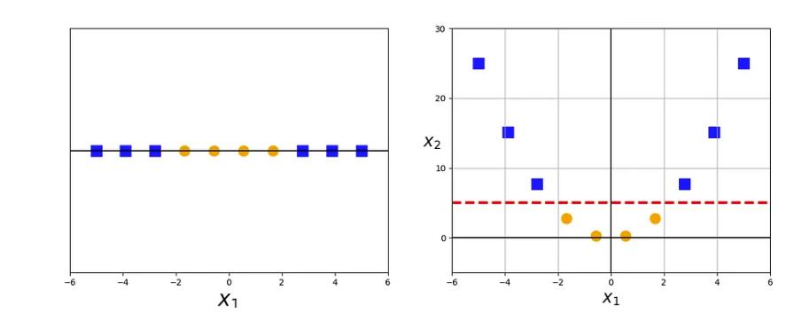

- 장점
    - 노이즈 데이터와 이상치를 잘 처리할 수 있습니다
    - 선형 분리가 불가해 보이는 것도 고차원 매핑을 통해 분리가 가능합니다
    - 고차원에서도 효과적이라고 알려져 있으며 local optimum에 빠질 수 있는 딥러닝 방식과는 달리 SVM은 global optimum을 찾습니다
    - model-based-learning으로 모델이 구축된 후엔 새로운 데이터에 대한 예측 및 분류 속도가 상대적으로 빠릅니다
- 단점
    - 분류 클래스가 여러 개가 되면 분류를 해야하는 경우의 수가 많아지기 때문에 모델을 구축하는데 시간이 오래 걸립니다
    - 최적 파라미터를 찾는 과정을 거치기 때문에 모형 구축 시간이 오래 걸릴 수 있습니다
    - 결과에 대한 설명력이 떨어집니다

#### Reference
- [The Kernel Trick in Support Vector Classification](https://towardsdatascience.com/the-kernel-trick-c98cdbcaeb3f)
- [ML #8: 머신러닝 SVM 기본 개념과 장단점](https://muzukphysics.tistory.com/entry/ML-8-%EB%A8%B8%EC%8B%A0%EB%9F%AC%EB%8B%9D-SVM-%EA%B8%B0%EB%B3%B8-%EA%B0%9C%EB%85%90%EA%B3%BC-%EC%9E%A5%EB%8B%A8%EC%A0%90-Support-Vector-Machine)
- [차원의 문제 - 다크 프로그래머](https://darkpgmr.tistory.com/145)
- [문과생도 이해하는 SVM(support vector machine)](https://binggre.tistory.com/m/1)
- [Kernel-SVM](https://ratsgo.github.io/machine%20learning/2017/05/30/SVM3/)
- [Support Vector Machine (SVM, 서포트 벡터 머신)](https://excelsior-cjh.tistory.com/66)

---

### 다른 좋은 머신 러닝 대비, 오래된 기법인 나이브 베이즈(naive bayes)의 장점을 옹호해보세요.

>💡 **나이브 베이즈의 장점** 
>- 조건부 확률(우도, 사후확률)만 계산하기 때문에 계산량이 적어서 빠르게 동작 
>- 노이즈 및 결측 데이터에 강인 함 
>- 각 피쳐들이 독립인 경우 다른 모델 대비 적은 데이터로 성능이 잘 나옴 
>- 멀티 클래스, 카테고리형 입력 데이터로 학습할 경우 적합 

- Naive Bayes 활용
    - 스팸 필터링
    - 비정상적인 상황 감지

#### Reference
- [쉽고 강력한 머신러닝, 나이브 베이즈 분류 (Naive Bayes Classification)](https://needjarvis.tistory.com/621)
- [데이터마이닝_확률기반 기계학습_나이브 베이즈](https://swingswing.tistory.com/148)
- [나이브 베이즈 분류기 (Naive Bayes Classifier)](https://mole-starseeker.tistory.com/78)
- [Naive Bayes Explained: Function, Advantages & Disadvantages, Applications in 2023](https://www.upgrad.com/blog/naive-bayes-explained/)

---

### 회귀 / 분류시 알맞은 metric은 무엇일까?

>💡 적절한 Metric
> - 회귀: 연속적인 값을 예측하기 때문에 실제 값과 예측하는 값의 차이에 기반을 둔 Metric을 사용합니다.  RSS(단순 오차 제곱 합), MSE(평균 제곱 오차), MAE(평균 절대값 오차), $R^2$(Coefficient of Determination 결정계수) 
> - 분류: 이산적인 값을 예측하기 때문에 값 클래스를 잘 예측했는지를 판별할 수 있는 Metric을 활용합니다. Confusion matrix를 활용한 accuracy, precision, recall, F1-score, ROC curve 등이 있습니다.

- 회귀 Metric
    - MAE (예측 변수의 분포가 가우시안일 경우 유리) 
    :실제 값과 예측 값의 차이를 절댓값으로 취한 값의 평균입니다. MSE와 비슷한 역할을 하지만, 이상치(outlier)에 덜 민감하고 해석하기 쉽다는 장점이 있습니다.
    - MSE(입력 데이터에 아웃라이어가 많은 경우 유리) 
    :실제 값과 예측 값의 차이를 제곱한 값의 평균입니다. 회귀 모델에서 가장 널리 사용되는 metric 중 하나입니다. MSE가 작을수록 모델의 예측이 정확하다는 것을 의미합니다.
    - $R^2$ 
    :실제 값의 분산 중 모델로 설명 가능한 부분의 분산의 비율입니다. 즉, 모델이 전체 분산 중 얼마나 설명할 수 있는지를 나타내는 지표입니다. R²가 1에 가까울수록 모델의 예측이 높은 정확도를 가집니다.
- 분류 Metric
    - Accuracy (데이터가 불균형한 경우 잘 작동하지 않음) 
    : 전체 샘플 중에서 모델이 정확하게 예측한 샘플의 비율입니다. 높을수록 좋은 모형입니다. 이진 분류와 다중 분류 문제에서 모두 사용할 수 있습니다.
    - Precision (FP가 중요한 문제에서 활용) 
    : 모델이 Positive로 예측한 샘플 중에서 실제로 Positive인 샘플의 비율입니다. 즉, 모델이 Positive로 예측한 것 중에서 얼마나 맞았는지를 나타내는 지표입니다.
    - Recall (FN이 중요한 문제에서 활용) 
    : 실제 Positive인 샘플 중에서 모델이 Positive로 예측한 샘플의 비율입니다. 즉, 모델이 실제 Positive인 것을 얼마나 잘 찾아냈는지를 나타내는 지표입니다.
    - F1 Score 
    : 정밀도와 재현율의 조화 평균입니다. 불균형한 데이터셋에서 사용됩니다. 정밀도와 재현율을 모두 고려하여 모델의 성능을 평가하는 지표입니다.
    - AUC ROC (멀티 클래스 문제 시각화에 유용) 
    : 분류 모델의 성능을 시각적으로 평가하는 방법 중 하나입니다. ROC 곡선은 FPR(False Positive Rate)을 x축으로, TPR(True Positive Rate)을 y축으로 나타내며, 분류 모델의 임계값(threshold)을 변경하면서 TPR과 FPR의 변화를 나타냅니다.
    분류 모델의 임계값이 높을수록 TPR은 낮아지고, FPR은 높아집니다. 반대로 임계값이 낮을수록 TPR은 높아지고, FPR은 낮아집니다. ROC 곡선에서 좌측 상단에 가까울수록 모델의 성능이 높다는 것을 의미합니다. 이때 ROC 곡선 아래쪽 면적을 AUC(Area Under the Curve)라고 하며, AUC가 1에 가까울수록 모델의 성능이 높다는 것을 나타냅니다.

#### Reference
- [회귀 / 분류시 알맞은 metric과 그에 대한 설명](https://mole-starseeker.tistory.com/30)
- [회귀 모형의 평가 지표](http://ds.sumeun.org/?p=2190)
- [5.4 분류 성능평가](https://datascienceschool.net/03%20machine%20learning/09.04%20%EB%B6%84%EB%A5%98%20%EC%84%B1%EB%8A%A5%ED%8F%89%EA%B0%80.html)
- [Metrics to Evaluate Classification and Regression Algorithms](https://medium.com/@poojitha.penmethsa/metrics-to-evaluate-classification-and-regression-algorithms-1554f1e00a75)

---