## Problem & Answer

### 고유값(eigen value)와 고유벡터(eigen vector)이 무엇이고 왜 중요한지 설명해주세요.

>💡 $n \times n$ 행렬 $A$를 선형변환으로 봤을 때, <b>선형변환 $A$에 의한 변환 결과가 자기 자신의 상수배가 되는 0이 아닌 벡터를 고유벡터라고 하고 이 상수배 값을 고유값</b>이라 한다.   
- 선형변환(Linear Transformation): 선형 결합을 보존하는 두 벡터 공간 사이의 함수   
$T(a+b) = T(a) + T(b), T(ca) = cT(a)$를 만족하는 변환.   
- 아래와 같은 식을 만족하는 열벡터 $v$를 eigen vector, 상수 $\lambda$를 eigen value라 한다.   

$$
Av = \lambda v
$$

- eigen vector, eigen value는 임의의 벡터를 어느 방향으로 변화시켰는지, 변환 과정에서 변화 없이 유지 되는 부분은 어느 부분인지에 대한 정보를 담고 있다.
- 어떤 물체나 영상 등은 수많은 벡터의 뭉치로 볼 수 있는데 eigen vector와 value를 활용해 물체나 영상이 어떤 식으로 변화하는지에 대한 정보를 파악할 수 있게 도와준다.
- 데이터의 특징을 파악할 수 있게 도와주는 SVD(특이값분해), Pseudo-Inverse, 선형연립방정식의 풀이, PCA(주성분분석)에 사용한다.

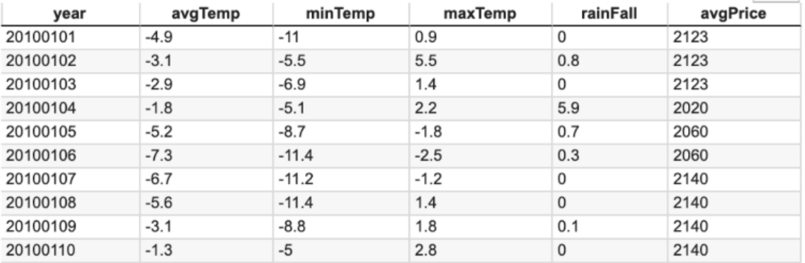

각 데이터의 Feature 간의 유사도는 모델 학습 결과에 영향을 끼치기 때문에 고유값과 고유벡터를 구해서 완전 독립 관계인 feature를 생성 혹은 추출하는 것이 중요하다.

#### Reference
- [[선형대수학 #3] 고유값과 고유벡터 (eigenvalue & eigenvector)](https://darkpgmr.tistory.com/105)
- [고유값(eigen value)과 고유벡터(eigen vector), 왜 중요한가?](https://kejdev.github.io/machinelearning/2021/01/04/eigen-value-eigen-vecotor.html)
- [eigen vector & eigen value](https://variety82p.tistory.com/entry/eigen-vector-eigenvalue?category=996031)

---

### 샘플링(Sampling)과 리샘플링(Resampling)이 무엇이고 리샘플링의 장점을 말해주세요.

>💡 샘플링은 모집단에서 일부만을 뽑아내서 모집단 전체의 경향성을 살펴보고 싶어 사용하는 방법으로 표본추출이라고 한다.
- Sampling 방식
    - Probability Sampling
        - Simple Random Sampling
        - Cluster Sampling(군집 표집)
        - Stratified Sampling(층화 표집)
        - Systematic Sampling(계통 표집)
    - Non-Probability Sampling
        - Convenience Sampling(편의 표본 추출)
        - Judgmental/Purposive Sampling(판단 표본)
        - Snowball/Referral Sampling(눈덩이 표집)
        - Quota Sampling( 할당량 샘플링)
- Sampling 장점
    - 시간과 비용을 줄임
    - 데이터가 정확성
    - 더 많은 모집단에 대한 예측 가능
    - 더 적은 자원으로 진행 가능

하지만 매우 정교한 추출이 이루어져도 모집단과 정확하게 일치할 수는 없으므로 이를 보완하기 위해 샘플링된 데이터에서 부분집합을 뽑아 통계량의 변동성을 확인하는 방법을 사용하는데 이를 리샘플링이라고 한다.
- 대표적인 리샘플링 기법으로는 k-fold 교차검증, bootstrapping 기법이 존재
- k-fold: k-1개의 부분집합들을 훈련 세트로 사용하고 나머지 하나의 부분집합을 테스트 세트로 사용하는 것을 말함
    - k번의 훈련과 테스트를 거쳐 결과의 평균을 구할 수 있음
- bootstrapping
    1. 표본 중 m개를 뽑아 기록하고 다시 제자리에 둔다.
    2. 이를 n번 반복한다.
    3. n번 재표본추출한 값의 평균을 구한다.
    4. 1~3단계를 R번 반복한다.(R: 부트스트랩 반복 횟수)
    5. 평균에 대한 결과 R개를 사용하여 신뢰구간을 구한다.
- 표본을 추출하면서 원래의 데이터셋을 복원하기에 모집단의 분포에 어떤 가정도 필요 없이 표본만으로 추론이 가능

#### Reference
- [샘플링과 리샘플링](https://variety82p.tistory.com/entry/%EC%83%98%ED%94%8C%EB%A7%81%EA%B3%BC-%EB%A6%AC%EC%83%98%ED%94%8C%EB%A7%81?category=996031)
- [DATA - 12. 부트스트랩(Bootstrap)](https://bkshin.tistory.com/entry/DATA-12)
- [샘플링과 리샘플링의 차이는 무엇일까?](https://kejdev.github.io/machinelearning/2021/01/25/sampling-resampling.html)

---

### 확률 모형과 확률 변수는 무엇인가요?

>💡 <b>확률 변수란 확률로 표현하기 위한 event를 정의하는 것으로 Sample space에서 확률 변수가 취할 수 있는 값에 따라 세 가지로 나뉜다.</b>


- 이산확률 변수: 취할 수 있는 값이 정수인 경우
- 연속확률 변수: 취할 수 있는 값이 실수인 경우
- 혼합랜덤 변수: 위의 두 가지 경우가 섞인 경우

확률 분포란 **확률변수의 모든 값과 그에 대응하는 확률들이 어떻게 분포**하고 있는지를 말한다.

이런 변수 성격에 따라 각각이 가지는 확률 함수의 이름도 달라지는데, 이산형은 **확률 질량 함수**라고 하고, 연속형은 **확률 밀도 함수**라고 부른다. 확률함수는 해당 확률 변수가 가진 확률 분포를 나타낸다.

- 확률 함수: 확률 변수를 0과 1 사이의 확률로 mapping하는 것
    - 일반적으로 수학에서 다루는 미지수라 생각하면 됨
    - $P(X=event) = probability$


>💡 <b>확률 모형이란 확률 변수를 이용하여 데이터 분포를 수학적으로 정의하는 것을 말한다.</b>


- 함수에 쓰인 계수들을 모수(parameter)라고 부른다.
- 확률 분포를 안다. → 확률 분포를 나타내는 확률 분포 함수를 안다. → 함수식을 구성하는 모수를 안다.
    - 확률 분포를 알면 확률 변수의 모든 값과 그에 대응하는 확률들을 안다.
    - 모수 추정이 중요한 이유

#### Reference
- [http://www.stat.yale.edu/Courses/1997-98/101/probint.htm](http://www.stat.yale.edu/Courses/1997-98/101/probint.htm)
- [https://ko.wikipedia.org/wiki/확률_변수](https://ko.wikipedia.org/wiki/%ED%99%95%EB%A5%A0_%EB%B3%80%EC%88%98)
- [숨니의 무작정 따라하기 - 확률변수와 확률모형](https://sumniya.tistory.com/24)
- [hanse’s.log - 확률 모형과 확률 변수](https://velog.io/@ohs2251/%ED%99%95%EB%A5%A0-%EB%AA%A8%ED%98%95%EA%B3%BC-%ED%99%95%EB%A5%A0-%EB%B3%80%EC%88%98)
- [Jupyter Community](https://notebook.community/zzsza/Datascience_School/09.%20%EA%B8%B0%EC%B4%88%20%ED%99%95%EB%A5%A0%EB%A1%A02%20-%20%ED%99%95%EB%A5%A0%20%EB%B3%80%EC%88%98/03.%20%ED%99%95%EB%A5%A0%20%EB%AA%A8%ED%98%95%EC%9D%B4%EB%9E%80)

---

### 누적 분포 함수와 확률 밀도 함수는 무엇인가요? 수식과 함께 표현해주세요.

>💡 <b>누적분포함수란 확률론에서 주어진 확률 분포가 특정 값보다 작거나 같은 확률을 나타내는 함수</b>


확률은 사건(event)이라는 표본의 집합에 대해 할당된 숫자이고 어떤 사건에 어느 정도의 확률이 할당되었는지 묘사한 것을 확률 분포라한다. 확률 분포를 묘사할 때, 모든 사건들을 하나씩 제시하는 것은 어려우므로 확률 변수를 이용한다면 묘사 작업이 간편해진다. 사건(event)이 구간(interval)이 되고 이 구간을 지정하는데 시작점과 끝점이라는 두개의 숫자만 있으면 되기 때문이다. 하지만 이를 정의할 때, 숫자 하나만으로 정의가 가능하도록 시작점을 음수 무한대로 통일하여 확률 분포를 서술할 수 있고, 이를 누적 확률 분포(CDF)라고 한다. 

$$
F(a) = P (X \le a) = \begin{cases}
   \sum_{x \le a} p(x) &\text{if } 이산형 \\
   \int_{-\infty}^a p(x)dx &\text{if } 연속형
\end{cases}
$$

누적 분포 함수는 확률 분포를 함수라는 편리한 상태로 바꾸어 주었고, 확률이 어느 사건에 어느 정도 분포되어 있는지 수학적으로 명확하게 표현해 준다. 그러나 누적 분포 함수는 분포의 형상을 직관적으로 이해하기 어렵다는 단점이 있고, 이를 알기 위해서 확률 변수가 나올 수 있는 전체 구간을 아주 작은 폭을 가지는 구간들로 나눈 다음 각 구간의 확률을 살펴보는 것이 편리하다. 그러나 이 과정에서 구간의 폭을 어느 정도로 정의해야 하는지에 대한 추가적인 약속이 필요하고 이러한 단점을 보완하기 위해 상대적인 확률 분포 형태만을 보도록 만들어진 것이 확률 밀도 함수이다. 누적 확률 분포 그래프 x축의 오른쪽으로 이동하면서 크기의 변화를 살펴보면 특정한 구간에서 확률이 배정되지 않는다면 기울기가 0이고 배정된다면 기울기가 0이 아닐 것이다. 따라서 기울기의 크기를 보면 각 위치에 배정된 확률의 상대적인 크기를 알 수 있고, 기울기의 크기를 구하는 수학적 연산이 미분이므로 확률 밀도 함수는 누적 분포 함수의 미분으로 정의한다. 이러한 이유로 확률밀도함수와 누적분포함수는 미적분의 관계를 가지고 있다.(데이터가 연속형일때만 해당)

$$
\int_{-\infty}^{\infty} f(x)dx = 1
$$

$$
P(a\le X \le b) = \int_a^b f(x)dx
$$

확률 밀도 함수는 확률 변수 X가 어떤 값 x를 가질 확률을 나타내는 것이 아니라, x 근처에서의 확률 밀도를 나타내는 것이다. 이때, 확률 밀도 함수는 다음과 같은 특성을 가진다.

1. f(x)는 항상 0보다 크거나 같다.
2. X의 값이 특정한 구간 a와 b 사이에 있을 확률은 확률 밀도 함수 f(x)와 a, b 사이의 면적을 구하여 나타낼 수 있다.
3. 확률 밀도 함수의 전체 면적은 1이다.

확률 밀도 함수는 각 확률 변수의 분포마다 다르게 정의된다. 예를 들어, 정규 분포의 확률 밀도 함수는 다음과 같다.

$$ 
f(x) = {1 \over \sqrt{2\pi\sigma^2}}e^{-(x-\mu)^2 \over 2\sigma^2}
$$

여기서 $\mu$는 평균값이며, $\sigma$는 표준 편차이다. 이 함수는 종 모양으로, 평균값을 중심으로 좌우로 대칭이며, 표준 편차가 작을수록 곡선이 좁아진다.

#### Reference
- [https://www.ncl.ac.uk/webtemplate/ask-assets/external/maths-resources/statistics/distribution-functions/cumulative-distribution-function.html](https://www.ncl.ac.uk/webtemplate/ask-assets/external/maths-resources/statistics/distribution-functions/cumulative-distribution-function.html)
- [https://ko.wikipedia.org/wiki/확률_밀도_함수](https://ko.wikipedia.org/wiki/%ED%99%95%EB%A5%A0_%EB%B0%80%EB%8F%84_%ED%95%A8%EC%88%98)
- [https://ko.wikipedia.org/wiki/누적_분포_함수](https://ko.wikipedia.org/wiki/%EB%88%84%EC%A0%81_%EB%B6%84%ED%8F%AC_%ED%95%A8%EC%88%98)
- [notebook community](https://notebook.community/junhwanjang/DataSchool/Lecture/08.%20%EA%B8%B0%EC%B4%88%20%ED%99%95%EB%A5%A0%EB%A1%A0%202%20-%20%ED%99%95%EB%A5%A0%EB%B6%84%ED%8F%AC/4\)%20%EB%88%84%EC%A0%81%20%EB%B6%84%ED%8F%AC%20%ED%95%A8%EC%88%98%EC%99%80%20%ED%99%95%EB%A5%A0%20%EB%B0%80%EB%8F%84%20%ED%95%A8%EC%88%98)
- [[확률/통계] 누적분포함수 (CDF, Cumulative Distribution Function)](https://roytravel.tistory.com/349)
- [확률 분포 함수와 확률 밀도 함수의 의미](https://velog.io/@groovallstar/%ED%99%95%EB%A5%A0-%EB%B6%84%ED%8F%AC-%ED%95%A8%EC%88%98%EC%99%80-%ED%99%95%EB%A5%A0-%EB%B0%80%EB%8F%84-%ED%95%A8%EC%88%98%EC%9D%98-%EC%9D%98%EB%AF%B8)

---

### 조건부 확률은 무엇인가요?

>💡 <b>Conditional Probability(조건부 확률이란?)</b>   
>
>주어진 사건이 발생했을 때, 다른 한 사건이 일어날 확률$P(B|A)$와 같이 표현하며 사건$A$에 대한 사건$B$의 조건부 확률이라 한다.


$$
P(B|A)={P(A \cap B) \over P(A)}
$$

$$
P(A \cap B) = P(B|A)P(A)
$$

이를 활용해 아래와 같이 베이즈 정리를 유도할 수 있다.

<center>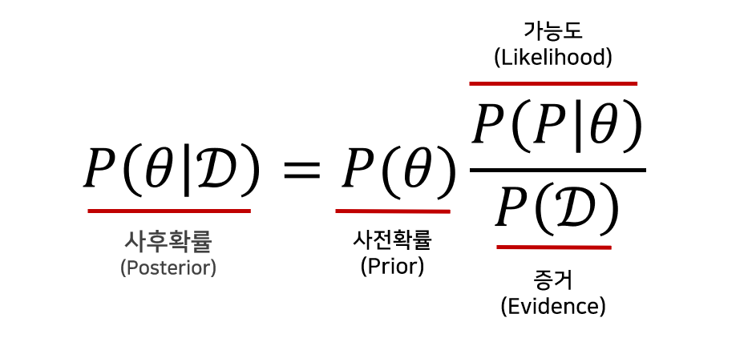</center>

- $D$: 새로 관찰되는 데이터
- $\theta$: 모델에서 계산하고 싶어하는 모수 (가설)
- 사후확률(Posterior): 데이터를 관찰했을 때, 이 가설이 성립할 확률 (데이터 관찰 이후 측정하기 때문에 사후확률)
- 사전확률(Prior): 가설에 대해 사전에 세운 확률 (데이터 관측 이후 사후확률이 사전확률이 된다.)
- 가능도(Likelihood): 현재 주어진 모수 (가정) 에서 이 데이터가 관찰될 가능성
- 증거(Evidence): 데이터 전체의 분포

#### Reference
- [http://www.stat.yale.edu/Courses/1997-98/101/condprob.htm](http://www.stat.yale.edu/Courses/1997-98/101/condprob.htm)
- [BoostDevs](https://github.com/boostcamp-ai-tech-4/ai-tech-interview/blob/main/answers/1-statistics-math.md#5)

---

### 공분산과 상관계수는 무엇일까요? 수식과 함께 표현해주세요.

>💡 <b>공분산(Convariance)</b>
>
>확률변수의 기댓값과 분산이 확률분포에 대한 정보를 주듯이 두 확률변수 X, Y 사이에서 정의된 공분산은 두 확률변수의 선형관계에 대한 정보를 알려 준다.
>
>💡 **상관계수(Correlation Coefficient)**
>
>공분산의 크기는 두 변수의 측정 단위에 따라 달라지므로 의미를 부여하기에 적절하지 않다. 공분산을 각 변수의 표준편차로 나누면 어떤 단위를 사용하든 같은 값을 얻게 되는데, 이 값을 상관계수라고 한다.


**공분산**

두 확률변수 X, Y의 기대값을 각각 $\mu x = E(X), \mu y = E(Y)$라고 하면 공분산은 다음과 같이 $X$의 편차와 $Y$의 편차의 곱으로 정의된다.

- 기본 정의
    
$$
Cov(X,Y) = \sigma_{xy} = E[(X-\mu x)(Y-\mu y)]
$$
    
- 이산 확률인 경우
    
$$
Cov(X,Y) = \sum_{(x,y)\in S} \sum (X - \mu x)(Y - \mu y)f(x,y)
$$
    
- 연속 확률인 경우
    
$$
Cov(X,Y) = \int_{S_2}\int_{S_1} (X - \mu x)(Y - \mu y)f(x,y)dxdy
$$
    

기대값의 성질을 이용하여 정리하면 다음과 같이 표현된다.

$$
Cov(X,Y) = E(XY) - E(X)E(Y)
$$

**공분산의 기본 성질**

- 상수 a에 대하여 $Cov(X, a) = 0$
- $Cov(X, Y) = Cov(Y,X)$
- $Cov(X,X) = V(X) \ge 0$
- $Cov(X_1+X_2,\ Y)=Cov(X_1,Y)+Cov(X_2,Y)$
- $Cov(aX,Y)=aCov(X,Y)$

**그래프 상에서의 공분산**

<center>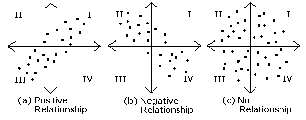</center>

- $Cov(X,Y) > 0$ : X가 증가할 때, Y도 증가한다.
- $Cov(X,Y) < 0$ : 가 증가할 때, Y는 감소한다.
- $Cov(X,Y) = 0$ : 아무런 선형관계가 없다.

**상관없음과 독립성**

두 확률변수 X, Y가 독립이면 $E(XY) = E(X)E(Y)$이므로 공분산은 0이 된다. 즉 X와 Y는 상관없다. 그러나 역은 일반적으로 참이 아니다.

**상관계수**

두 확률 변수 X, Y의 상관계수는 $\rho x,y$ 또는 $Corr(X,Y)$로 나타내며 다음과 같이 정의한다

$$
\rho_{x,y} = Corr(X,Y) = {Cov(X,Y)\over \sqrt {V(X)V(Y)}} ,-1\le \rho \le 1
$$

- 상관계수의 성질
    - 상관계수의 절대값은 1을 넘을 수 없다.
    - 확률변수 X, Y가 독립이라면 상관계수는 0이다.
    - X, Y가 선형관계인 Y = aX + b의 관계일 때 a가 양수면 상관계수는 1 a가 음수면 -1이다.

#### Reference
- [https://online.stat.psu.edu/stat414/lesson/18/18.1](https://online.stat.psu.edu/stat414/lesson/18/18.1)
- [https://datascienceschool.net/02 mathematics/07.05 공분산과 상관계수.html](https://datascienceschool.net/02%20mathematics/07.05%20%EA%B3%B5%EB%B6%84%EC%82%B0%EA%B3%BC%20%EC%83%81%EA%B4%80%EA%B3%84%EC%88%98.html)
- [공분산(Covariance)과 상관계수(Correlation)](https://destrudo.tistory.com/15)
- [https://terms.naver.com/entry.naver?docId=3404964&cid=47324&categoryId=47324](https://terms.naver.com/entry.naver?docId=3404964&cid=47324&categoryId=47324)

---

### 신뢰 구간의 정의는 무엇인가요?

>💡 <b>모집단에서 표본을 추출하여 표본평균을 계산했을 때 정해진 확신의 정도를 가지고 미지의 모수가 속할 것으로 기대되는 구간을 신뢰구간(confidence Interval)이라 한다.
>
>이때 추정한 구간 안에 실제로 모수가 들어있을 확신의 정도를 신뢰수준(신뢰도, confidence level) 또는 신뢰계수 (confidence coefficient)라 한다. 보통 신뢰수준은 백분율로 나타내며, 신뢰계수는 0부터 1 사이의 값으로 나타낸다.</b>


1m 물체의 길이를 추정할 때 길이는 유한하다고 말한다면 신뢰수준 100%가 될 수 있지만 이것은 무의미한 추정이므로 적절한 신뢰수준의 신뢰구간을 추정하는 것이 중요하다.

관측 횟수가 n이고 관측 결과의 평균이 M이라면, n번씩 관측할 때마다 얻어지는 평균값 M들의 값은 당연히 참값에 매우 가까워진다. 더욱 가까워진다는 것은 M들의 표준편차가 작다는 뜻이 되는데, 관측 결과 하나하나가 표준편차 σ인 정규분포를 따른다면, n번 관측하여 얻어지는 M의 표준편차는 다음과 같이 된다.

$$
N번\ 관측하여 \ 얻어지는\ M의\ 표준편차\ =\ \sigma / \sqrt{n}
$$

표본 평균의 평균은 모평균과 같으므로 참값이 m미터라면 **중심극한정리**에의해 관측 결과의 평균 M은 평균이 m이고 표준편차가 $\sigma/\sqrt{n}$인 정규분포를 따르게 되고 정규분포 그래프를 통해 다음의 사실을 알 수 있다.

$$
m-\sigma/\sqrt {n}< M < m+\sigma/\sqrt {n}\ 일\ 확률이\ 약\ \ 68 \\% 이다.
$$

위 식을 m을 기준으로 이항 정리하면 아래와 같다

$$
M-\sigma/\sqrt{n}< m < M+\sigma/\sqrt{n}\ 일\ 확률이\ 약\ \ 68 \\% 이다.
$$

이를 통해 참값 m이 관측으로부터 구한 평균값 M 근처에 있을 확률을 표현할 수 있게 된다.

확률 68%를 **신뢰수준**, **신뢰도**라 하며 100%에서 신뢰수준을 뺀 32%를 **유의수준**이라고 한다.

이는 표본을 100번 추출했을 때 100개의 신뢰구간 중에 95개 정도가 모수의 참값을 포함하고 5개 정도는 모수의 참값을 포함하지 않는다는 것을 의미한다.

<center>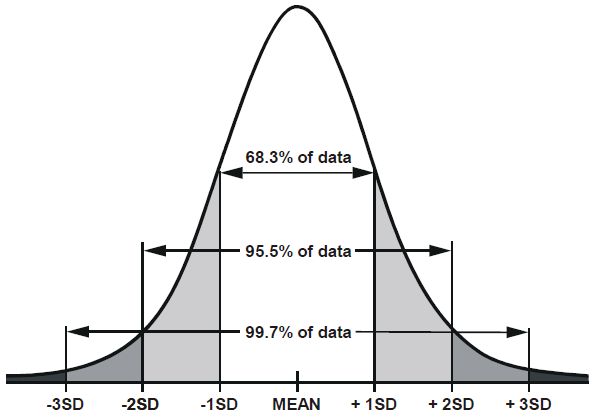</center>

**신뢰 구간의 특성**

- 신뢰 구간이 좁을수록 모집단 평균 추정치가 정확해진다.
- 일반적으로 표본 크기가 클수록, 신뢰 구간이 좁아진다.

**중심극한정리**

- 모집단에서 표본 평균을 끝없이 구할 수록 표본 평균의 분포는 정규 분포를 따르게 됨

#### Reference
- [https://angeloyeo.github.io/2021/01/05/confidence_interval.html](https://angeloyeo.github.io/2021/01/05/confidence_interval.html)
- [https://terms.naver.com/entry.naver?docId=6512706&cid=60207&categoryId=60207](https://terms.naver.com/entry.naver?docId=6512706&cid=60207&categoryId=60207)
- [https://terms.naver.com/entry.naver?docId=3569431&cid=58944&categoryId=58970](https://terms.naver.com/entry.naver?docId=3569431&cid=58944&categoryId=58970)

---

### P-value를 모르는 사람에게 설명한다면 어떻게 설명하실 건가요?

>💡 <b>p-value란 얻은 검정 통계량(ex, t-value)보다 크거나 같은 값을 얻을 수 있는 확률 이때, 검정 통계량의 대부분이 귀무가설을 가정하고 얻게 되는 값</b>


“모평균이 100이다”라는 귀무가설이 참이라는 가정 하에서, 100개의 데이터를 sampling 할 때 이론적으로 나올 수 있는 평균의 분포에서, 지금 내가 갖고 있는 표본 평균의 값인 95보다 큰 값이 나올 수 있는 확률을 말한다.

위의 예시에서 그럴 확률이 매우 낮다면 귀무가설을 기각할 수 있게 된다.

우연히 발생할 가능성이 매우 희박한 사건이 실제로 발생했을 경우, 그것을 우연이 아니라고 생각하는 경향이 있고, p-value 역시 그와 같은 경향을 따른 것이기 때문이다.

일반적으로 P-value가 5% 보다 작으면 귀무가설을 기각한다.
하지만 이 5% 기준은 전통적으로 사용하는 수치이기 때문에 실험자가 조정 가능하다.

일반적으로 p-value가 너무 낮으면, 그렇게 낮은 확률의 사건이 실제로 일어났다고 생각하기 보다는 귀무가설이 틀렸다고 생각하게 된다. 그래서 귀무가설을 기각하고 대립가설을 채택하게 되는데 p-value는 검정 통계량이 압축적으로 담고 있던 정보를 더 압축했기 때문에 효과의 크기(effect size)가 커지거나 표본의 크기(n)가 커지면 p-value는 작아진다는 것을 명심해야 한다.

p-value가 의미하는 것: 효과의 크기 (effect size, 표본의 크기)
- p-value가 작은 이유는 effect size가 크기 때문인지 표본의 크기가 크기 때문인지 알 수 없음

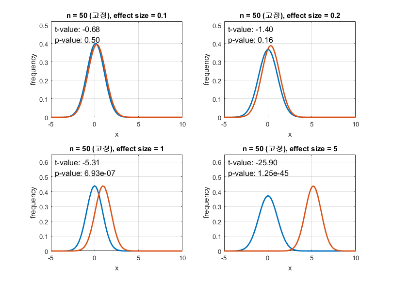 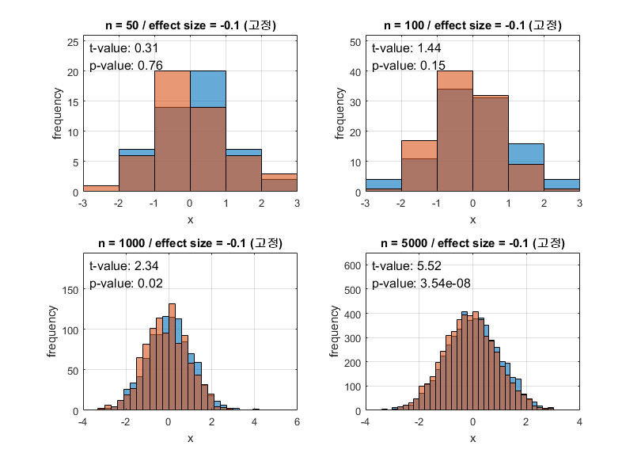


#### Reference
- [https://angeloyeo.github.io/2020/03/29/p_value.html](https://angeloyeo.github.io/2020/03/29/p_value.html)
- [https://www.scribbr.com/statistics/p-value/](https://www.scribbr.com/statistics/p-value/)
- [https://adnoctum.tistory.com/332](https://adnoctum.tistory.com/332)
- [https://terms.naver.com/entry.naver?docId=3580638&cid=58944&categoryId=58970](https://terms.naver.com/entry.naver?docId=3580638&cid=58944&categoryId=58970)
- [https://terms.naver.com/entry.naver?docId=6458445&cid=68053&categoryId=68053](https://terms.naver.com/entry.naver?docId=6458445&cid=68053&categoryId=68053)

---

### R square의 의미는 무엇인가요?

>💡 <b>Coefficient of Determination은 회귀 모델에서 독립 변수가 종속변수를 얼마만큼 설명해 주는지 가리키는 지표(높을 수록 잘 설명)</b>


#### 결정계수 시각화 예시

<center>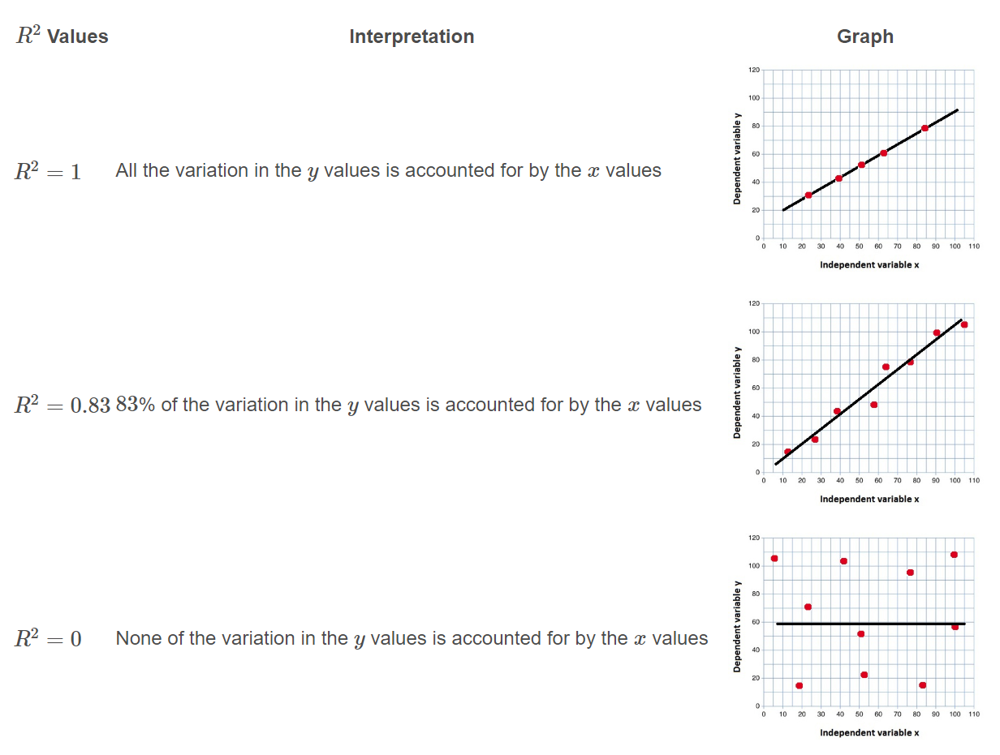</center>

#### 결정계수 계산 방법
$$
R^2 = 1-{Residual\ Sum \ of \ Squares \  (SSR) \over total\ Sum \ of \ squares\ (SST)} = {Explained\ Sum \ of\ Squares \ (SSE) \over total\ Sum \ of \ squares \ (SST)}\\
$$

1. SST : 
    관측값에서 관측값의 평균을 뺀 결과의 총합
    
$$
SST = \sum^n_{i=1}(y_i-\overline y)^2
$$

2. SSE :
    추정값에서 관측값의 평균을 뺀 결과의 총합
    
$$
SSE = \sum^n_{i=1}(\hat y - \overline y_i)^2
$$

3. SSR :
    관측값에서 추정값을 뺀 값의 총합
    
$$
SSR = \sum^n_{i=1}(y_i-\hat y)^2
$$

#### Reference
- [https://m.blog.naver.com/tlrror9496/222055889079](https://m.blog.naver.com/tlrror9496/222055889079)
- [https://www.ncl.ac.uk/webtemplate/ask-assets/external/maths-resources/statistics/regression-and-correlation/coefficient-of-determination-r-squared.html](https://www.ncl.ac.uk/webtemplate/ask-assets/external/maths-resources/statistics/regression-and-correlation/coefficient-of-determination-r-squared.html)
---

### 평균(mean)과 중앙값(median) 중에 어떤 케이스에서 뭐를 써야할까요?

>1. <b>자료값의 분포가 대칭적이고 단일봉 형태인 경우 : 평균</b>
>2. <b>자료의 값에 한 개 이상의 극단적인 값이 있는 경우 : 중앙값</b>
>3. <b>자료의 값의 분포가 한 쪽으로 치우친 경우 : 중앙값</b>

<b>평균 종류</b>
1. 산술평균 : 
    이상치에 민감
    
$$
{ a+b }\over n
$$
    
2. 기하평균 :
    기간 별 상승 하락 계산 시 유용
    
$$
\sqrt[n]{ab}
$$
    
3. 조화평균 :
    F1 score를 구할 때 사용
    
$$
2ab \over {a+b}
$$

#### Reference
- [https://terms.naver.com/entry.naver?docId=3338104&cid=47324&categoryId=47324](https://terms.naver.com/entry.naver?docId=3338104&cid=47324&categoryId=47324)
- [https://lsh-story.tistory.com/76](https://lsh-story.tistory.com/76)
---

### 중심극한 정리는 왜 유용한걸까요?

>💡 표본 크기가 n인 표본을 여러 번 반복해서 추출했을 때 각 표본 평균들이 이루는 분포가 정규분포가 이루게 된다. 이 때, 정규분포의 평균은 모집단의 평균이고 정규분포의 표준편차는 모집단의 표준편차를 $\sqrt n$ ($n$: 표본의 크기)으로 나눈 형태로 나타나기 때문에 이를 기반으로 모수를 추정할 수 있기 때문에 유용하다.


<center>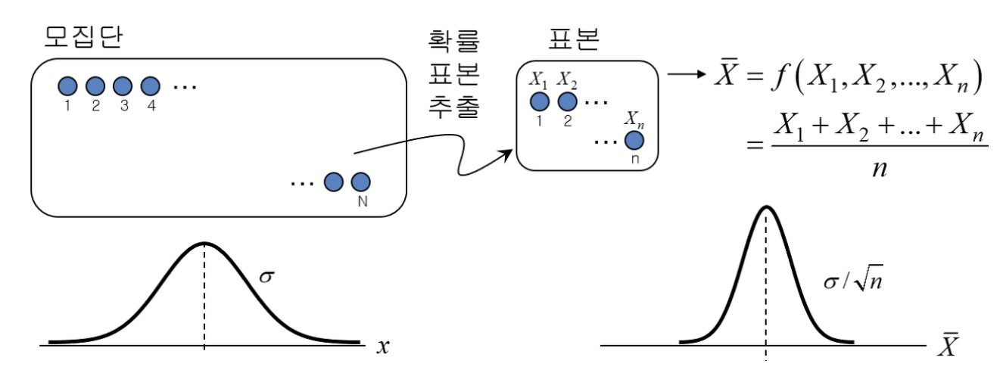</center>

- i.i.d.(independent and identically distribution) 가정이 성립하고 평균, 표준편차만 알고 있으면 $X_i$의 분포 자체에 대한 정보가 없더라도 $\xi_n$의 분포를 점근적으로 알 수 있다.

$$
\xi_n = {\sum_{i=1}^n X_i - n\mu \over \sqrt n \sigma}
$$

- 데이터(혹은 표본)가 충분하지 않은 상황에서 정규분포로 가정하는 것은 올바르지 않다. 즉 극단적인 사례가 발생할 상황은 과소 평가 되기 쉽고 대부분의 상황을 정규분포로 가정해서 큰 피해를 본 경우가 2008년 금융 위기이다.

#### Reference
- [필로홍의 데이터 노트](https://drhongdatanote.tistory.com/57)
- [Truth in Engineering](https://m.blog.naver.com/mykepzzang/220851280035)
---

### 엔트로피(entropy)에 대해 설명해주세요. 가능하면 Information Gain도요.


>💡 <b>Entropy</b>란 최적의 전략 하에서 그 사건을 예측하는 데에 필요한 질문 개수를 의미한다. 
다른 표현으로는 최적의 전략 하에서 필요한 질문 개수에 대한 <b>기댓값</b>이다. 따라서, 이 entropy가 감소한다는 것은 우리가 그 사건을 맞히기 위해서 필요한 질문의 개수가 줄어드는 것을 의미하고 질문의 개수가 줄어든다는 사실은 정보량도 줄어든다는 의미이다.


$$
I(x) = -log_b(P(x)) \ \ (b = 2,e,10 ...)
$$

- log로 표시하는 이유
    - 확률과 반비례 관계
    - 두 사건의 정보량의 합은 각 사건의 정보량의 합과 같아야 하기 때문에

$$
질문개수 = log_2(가능한 결과의 수)\\
H = nlog(s)\\ \space \space \space \space =log(s^n) \\
H(x)=\sum^{n}_{i=1}P(x_i)(-log_b(P(x_i)))
$$

- Entropy는 가능한 모든 사건이 같은 확률로 일어날 때 그 최댓값을 가짐

>💡 <b>Information Gain(IG)</b>은 어떤 속성을 선택함으로 인해서 데이터를 더 잘 구분하게 되는 것을 말한다. 이는 어떤 조건으로 데이터를 분류할 때 엔트로피가 얼마나 감소 하는지를 측정함으로써 계산할 수 있고 Decision Tree의 부모 노드와 자식 노드의 차이가 이에 해당한다.


- Decision Tree
    - 자식 노드가 부모 노드보다 더 순수도가 높은 자식 노드들이 되도록 데이터를 반복적으로 더 작은 집단으로 나누는 것

$$
IG(feature) = H_{before} - H_{split\ by\ feature}\\
Gain(A) = I(_{S_1,S_2,S_3,...,S_m)}-E(속성(A)) \ \ (S_1,S_2,...는 \ 상위\ 노드의\ 엔트로피)
$$

- 정보 이득은 상위 노드의 엔트로피에서 하위 노드의 엔트로피를 뺀 값이다. 그리고 E(A)는 A라는 속성을 선택했을 때 하위로 작은 m개의 노드로 나누어진다고 하면 하위 각 노드의 엔트로피를 계산 한 후 노드의 속한 레코드의 개수를 가중치로 하여 평균한 값이다.
- Gain(A)는 속성 A를 선택했을 때의 정보 이득 양을 계산하는 수식으로 원래 노드의 엔트로피를 구하고, 방금 구한 엔트로피를 선택한 후의 m개의 하위 노드로 나누어진 것에 대한 전체적인 엔트로피를 구한 후의 값을 뺀 결과이다.
- Gain(A) 값이 클수록 정보 이득이 큰 것이고, 변별력이 좋다는 것을 의미한다.

#### Reference
- [결정 트리 설명 및 분류기 구현](https://needjarvis.tistory.com/709)
- [엔트로피 이해하기](https://needjarvis.tistory.com/716)
- [정보 이득 이해하기](https://needjarvis.tistory.com/718)
- [공돌이의 수학정리노트](https://angeloyeo.github.io/2020/10/26/information_entropy.html)
- [[인공지능] 엔트로피(Entropy) 와 정보이득(Information Gain) 계산](https://eehoeskrap.tistory.com/13)
- [Voyager - Information Gain](https://gmnam.tistory.com/207)
- [초보를 위한 정보이론 안내서](https://hyunw.kim/blog/2017/10/14/Entropy.html)

---

### 어떨 때 모수적 방법론을 쓸 수 있고, 어떨 때 비모수적 방법론을 쓸 수 있나요?


>💡 **모수적 방법론(Parametric method)**: 모집단의 분포가 특정 확률분포(Probability Distribution)의 형태로 나타나는 경우 사용한다.
**비모수적 방법론(Nonparametric method)**: 표본의 수가 적어 정규분포를 가정할 수 없는 경우, 모집단에 대한 정보가 없는 경우 사용한다.


- 모수적 방법
    - 관측 값이 어느 특정한 확률분포를 따른다고 전제한 후 그 분포의 모수에 대한 검정을 실시할 때 사용 가능하다.
    - 중심 극한 정리에 의해 일정 수 이상의 표본은 모집단의 분포와 상관없이 정규분포에 근접한다.
    - 확률분포의 평균, 표준편차 등의 모수를 비교함으로써 집단간의 차이를 밝힐 수 있다.
- 비모수적방법
    - 관측 값이 어느 특정한 확률분포를 따른다고 전제할 수 없는 경우, 모집단에 대한 아무런 정보가 없는 경우에 사용 가능하다.
    - 자료를 크기 순으로 배열하여 순위를 매긴 다음 순위의 합을 통해 차이를 비교하는 순위합검정을 적용할 수 있다.
- 관련 모델
    - 모수적 모델
        - 회귀모델, 로지스틱회귀모델, 1차/2차 판별 모델(LDA / QDA)
    - 비모수적 모델
        - 의사결정나무, 랜덤포레스트, K-근접 이웃(KNN)
    - 인공신경망의 경우 모수적 모델과 비모수적 모델 두 방법이 혼재한다.

#### Reference
- [모수 모델 vs. 비모수 모델 머신러닝 모델링 관점에서](https://brunch.co.kr/@seoungbumkim/7)
- [통계용어 - 모수적, 비모수적 방법](https://datacookbook.kr/64)
- [제 13장. 비모수적 방법(Distribution-free Method)](http://contents.kocw.net/KOCW/document/2013/koreasejong/HongSungsik4/13.pdf)
- [[통계이론] 모수적 방법 vs 비모수적 방법](https://zzanhtt.tistory.com/18)

---

### “likelihood”와 “probability”의 차이는 무엇일까요?


>💡 **확률(Probability)**: 주어진 확률분포가 있을 때, 관측값 혹은 관측 구간이 분포 안에서 일어날 가능성을 뜻하고 $f(x|\theta)$ 로 표현한다.
**가능도(Likelihood)**: 어떤  값이 관측 되었을 때 이것이 어떤 확률 분포에서 왔는지에 대한 가능성을 뜻한다. $\mathcal{L}(\theta|x)$ 로 표현한다.


<center>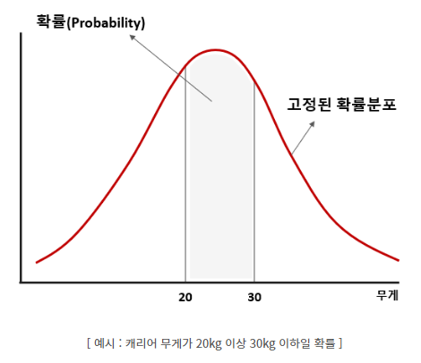</center>

- 여행을 가기 위해 캐리어에 짐을 쌓았을 때 캐리어 무게를 예로 든다면, 확률은 확률분포가 고정됐을 때 캐리어 무게가 20~30인 사건이 일어날 가능성을 뜻한다.

<center>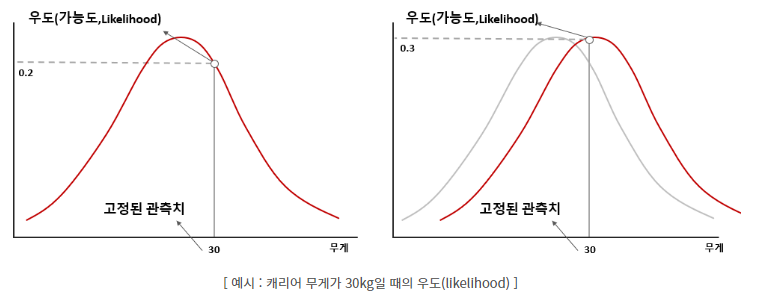</center>

- 가능도는 고정된 사건에서 사건이 일어날 확률분포에 대한 가능성을 의미한다. 왼쪽은 30kg 캐리어를 관찰할 가능성은 0.2고 오른쪽은 0.3이다. 따라서 가능도는 왼쪽보다 오른쪽이 더 크다.

- 확률은 어떤 시행(trial, experiment)에서 특정 결과(sample)가 나올 가능성. 즉, 시행 전 모든 경우의 수의 가능성은 정해져 있으며 그 총합은 1(100%)이다.
- 가능도는 어떤 시행(trial, experiment)을 충분히 수행한 뒤 그 결과(sample)를 토대로 경우의 수의 가능성을 도출하는 것. 아무리 충분히 수행해도 어디까지나 추론(inference)이기 때문에 가능성의 합이 1이 되지 않을 수도 있다.

#### Reference
- [StatQuest: Maximum Likelihood 최대 우도 추정, 매우 깔끔하게 설명되었습니다!!!](https://www.youtube.com/watch?v=XepXtl9YKwc&t=252s)
- [[기초통계] 확률(Probability) vs 우도(가능도,Likelihood)](https://dlearner.tistory.com/43)
- [[수리통계학] 가능도는 확률과 어떻게 다르지?](https://blog.naver.com/sw4r/221361565730)
- [가능도(Likelihood)와 확률(Probability)의 차이](https://swjman.tistory.com/104)

---

### 통계에서 사용되는 bootstrap의 의미는 무엇인가요.

>💡 **단일 랜덤 표본에서 복원 추출을 진행해서 표본 추출 분포를 추정하는 방법으로 대표적인 리샘플링 기법 중 하나**

- 장점
    : 평균(mean)같이 표준 오차가 잘 알려진 추정량들은 이런 부트스트랩 같은 방법을 쓸 이유가 없지만 표준 오차를 계산하는 방법이 잘 알려져 있지 않은 추정량들의 경우 부트스트랩 방법을 통해 오차 범위를 파악할 수 있음

- 사용 시기
    : 확률 변수의 정확한 확률 분포를 모르는 경우나 측정된 샘플이 부족한 경우

- 신뢰 구간을 구하는 절차
    1. 전체 n개의 표본 중 하나를 뽑아 기록 후 다시 표본에 삽입
    2. m번 반복
    3. m번 재표본추출한 값의 평균을 계산
    4. 1~3번을 K번 반복(K가 클수록 신뢰구간 추정이 정확해짐)
    5. 평균에 대한 결과 K개를 사용하여 신뢰구간을 구함

<center>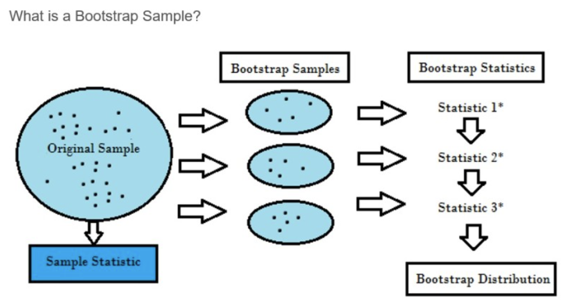</center>

#### Reference

- [4.2. Bootstrp - An Introduction to Statistical Learning](https://wikidocs.net/33014)   
- [부트스트랩 샘플링이란?](https://m.blog.naver.com/PostView.naver?isHttpsRedirect=true&blogId=mathnstat&logNo=221404758083)   
- [DATA -12. 부트스트랩](https://bkshin.tistory.com/entry/DATA-12)   
- [공돌이의 수학정리노트](https://angeloyeo.github.io/2021/07/19/jackknife_and_bootstrap.html#%EA%B0%9C%EC%9A%94)

---
### 모집단의 수가 매우 적은 (수십개 이하) 케이스의 경우 어떤 방식으로 예측 모델을 수립할 수 있을까요?

>💡 **표본의 수가 적은 경우라도 모집단이 정규분포를 따른 다면 모수적 방법을 통해 예측 모델을 수립할 수 있다.   
>하지만 정규분포를 따르는지 알 수 없다면 Shapiro-Wilk 검정 등의 모집단 정규성 검증을 통해 정규분포를 따르는지 검증해볼 수 있고 검증도 되지 않는다면 이때는 비모수적인 방법을 사용해야한다.**

<center>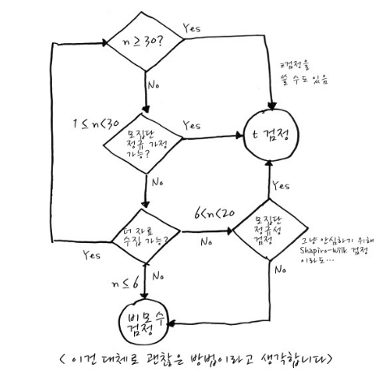</center>

- 정규성 검정 → 표본을 통해 모집단이 정규 분포하는지 검정하는 것
    - Null Hypothesis : 모집단이 정규분포를 이루고 있다고 검정
    - Alternative Hypothesis : 모집단이 정규분포를 이루고 있지 않다고 검정
    - 검정방법
        - Shapiro-Wilk 검정 : 소표본에 평균을 활용한 검정을 위한 모집단 정규성 검정에 적합
        - Kolmogorov-Smirnov 검정 : 소표본에 평균을 활용한 검정을 위한 모집단 정규성 검정에 적합
- 비모수적 방법론
: 비모수적 방법은 검정력이 다소 떨어지고, 크기의 차이를 보여주지 못하는 대신에 표본수가 작은 경우이거나 순위 척도인 경우를 비롯하여 숫자로 되어 있는 모든 경우에 적용을 할 수 있는 장점이 있다.
    - KNN, Random forest, Decision Tree
    - 부호 검정(sign test): 분포의 중앙값에 대하여 검정하는 기법으로, 표본자료보다 큰 것은 + 작은 것은 - 를 부여하여 개수를 비교
    - 런(run) 검정: 어떤 패턴이나 경향이 없이 랜덤하게 구성되었다는 귀무가설을 검정하기 위한 방법, 표본 데이터를 서로 배타적인 2개의 범주로 나누어 접근
    - Wilcoxon 순위합 검정(Mann-Whitney 검정): 두 모집단의 중앙값이 같다는 귀무가설에 대하여 비모수적으로 검정하는 방법으로 두 모집단은 서로 독립이어야 함.
    - Wilcoxon 부호 있는 순위 검정: 두 모집단이 독립이 아닐 시 사용
    - Kruskal-Wallis 검정: 3개 이상의 모집단을 비교하는데 사용되는 비모수 검정

#### Reference
- [비모수적 방법 - Medical Programmer](http://theyoonicon.com/%EB%B9%84%EB%AA%A8%EC%88%98%EC%A0%81-%EB%B0%A9%EB%B2%95/)   
- [표본 크기가 작을 때(n<30)는 어떻게 해야 하죠? 정규성 검정은 꼭? 이걸 모르면 궁금증의 지옥행](https://recipesds.tistory.com/entry/%ED%91%9C%EB%B3%B8-%EC%88%98%EA%B0%80-%EC%9E%91%EC%9D%84-%EB%95%8C%EB%8A%94-%EC%96%B4%EB%96%BB%EA%B2%8C-%ED%95%B4%EC%95%BC-%ED%95%98%EC%A3%A0-%EC%A0%95%EA%B7%9C%EC%84%B1-%EA%B2%80%EC%A0%95%EC%9D%80-%EA%BC%AD-%EC%9D%B4%EA%B1%B8-%EB%AA%A8%EB%A5%B4%EB%A9%B4-%EA%B6%81%EA%B8%88%EC%A6%9D%EC%9D%98-%EC%A7%80%EC%98%A5-%ED%96%89)   
- [[통계이론] 모수적 방법 vs 비모수적 방법](https://zzanhtt.tistory.com/18)    

---

### 베이지안과 프리퀀티스트 간의 입장차이를 설명해주실 수 있나요?

>**베이지안**은 현재까지 얻은 표본을 업데이트 하여 사후확률을 계산한다. 모수가 고정되어 있지 않고 데이터 수집에 의해 바뀔 수 있다고 생각한다.
>**프리퀀티스트**는 현재까지 얻은 표본 외에 얻을 예정이거나 얻지 못한 표본까지도 분석하여 모수를 추정한다. 또한 모수는 고정되어 있다고 생각한다.

예시로 부덕이가 약속 시간에 늦는 시간이 $N(10,5^2)$를 따른다고 가정하면
**프리퀀티스트**는 “부덕이는 원래 10분씩 늦는 애야.” 라고 모수를 바탕으로 추론하여 대답할 것이고,**베이지안**은 “부덕이는 맨날 보면 10분 정도 늦더라.” 라고 모수의 분포를 추론하여 10분 늦을 확률이 가장 높다고 판단하여 이와 비슷한 대답을 할 것이다.

관점에 따른 차이일 뿐 통계적 추론에 의해 나온 대답인 것은 차이가 없다. 하지만 부덕이가 약속시간에 정확히 맞춰왔을 때 둘의 입장 차이가 생긴다.

**프리퀀티스트**는 “부덕이가 제 시간에 맞춰 오는건 그 확률이 3% 가 안 될 정도로 드문 경우긴 해.”
**베이지안**는 “부덕이가 일찍 올 때도 있구나. 다음에도 이 때 올까?”

그리고 둘에게 부덕이가 다음번에도 약속시간에 정확히 나올 것인지 물어본다면 대답은 크게 달라진다.

**프리퀀티스트**는 “부덕이가 바뀐 것이라고 보긴 힘들어 약속 시간에 맞춰 나오는 것은 일어날 수 있는 일이야”
**베이지안**은 “부덕이가 늦게 나올 확률은 여전히 높지만 약속 시간에 맞춰 나올 확률이 올라간 것도 사실이야”

**프리퀀티스트**는 새롭게 얻은 관측값이 이미 내린 결론에 부합하는지만을 확인할 뿐이지만 **베이지안**은 기존에 갖고 있던 결론에 즉시 업데이트함으로써 새로운 사후분포를 구한 것으로 볼 수 있다.

- 머신러닝 분야에서 베이지안 방법론이 크게 활용된 이유
    - 베이즈룰을 계산하기 위한 조건 → **이전에는 계산하기 까다로움**
        1. 가능도: 파라미터($\theta$)를 배경으로 하는 관측결과($D$)의 확률
        2. 사전확률: 파라미터($\theta$)의 확률
        3. 정규화상수 : D 자체의 확률
    
    → 컴퓨팅 기술 및 알고리즘의 발달로 빠른 속도로 계산할 수 있게 되면서 보편적으로 적용
    
- 빈도론
    
    장점: 대용량의 데이터만 처리할 수 있다면 계산이 복잡하지 않아서 쉽게 처리 가능
    
    단점: 데이터 부적, 결측치 존재, 아웃라이어 포함 등 데이터가 불확실한 경우 결과물의 질이 낮아짐
    
- 베이지안
    
    장점: 확률 모델이 명확히 설정되어 있다면 베이지안으로 검증된 가설의 타당성이 높은 것으로 고려됨
    
    단점: 사전확률에 대한 모델링이 어렵고 모델링에 따라 결과가 크게 달라질 수 있음
    

#### Reference
- [Frequentist and Bayesian](https://www.ibric.org/myboard/read.php?id=19818&Page=&Board=SORI&FindIt=&FindText)
- [빈도론과 베이지안 방법론 비교](https://m.blog.naver.com/61stu01/221277477927)
- [3주차_#2. 베이지안(Bayesian)과 프리퀀티스트(Frequentist) 간의 입장 차이](https://astralworld58.tistory.com/81)
- [베이지안 패러다임](https://freshrimpsushi.github.io/posts/bayesian-paradigm/)

---

### 검정력(statistical power)은 무엇일까요?

>💡 대립가설이 사실일 때, 이를 사실로서 결정할 확률 = 귀무가설을 올바르게 기각하는 확률
>
>검정력이 90%라고 하면, 대립가설이 사실임에도 불구하고 귀무가설을 채택할 확률(2종 오류, β error)의 확률은 10%이다. 검정력이 좋아지게 되면, 2종 오류(β error)를 범할 확률은 작아지게 된다. 따라서 검정력은 1-β과 같다.

********************************************************************검정력을 높이기 위한 방법********************************************************************

1. 유의 수준(1종 오류)을 높힌다. == 신뢰 수준을 낮춘다.
2. 표본의 크기를 키운다.
    
    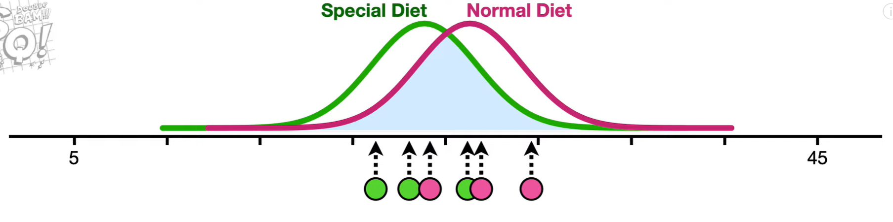
    
3. 효과 크기(두 모집단의 차이)를 키운다.
    
    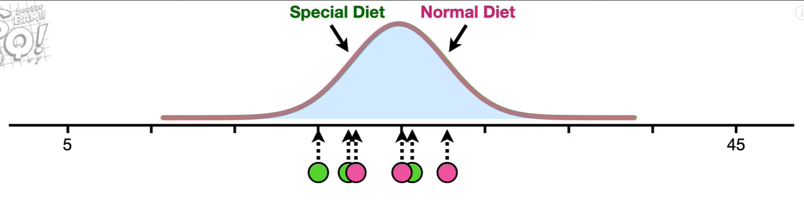
    

**효과 크기란?**

연구되는 현상이 실제로 모집단에 존재하는 정도

집단 차이 검증 시, 집단 평균 값들의 차이를 표준편차로 나눠 차이가 클수록 효과 크기는 크게 나타남

**1종 오류, 2종 오류, 검증력과의 관계**

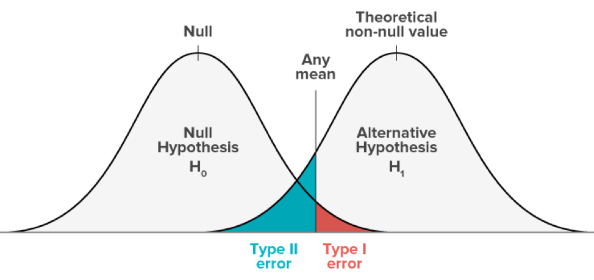

왼쪽의 분포는 귀무가설의 확률분포이고 오른쪽은 표본을 통해 구한 대립가설의 확률분포이다.

Any mean을 기준으로 오른쪽은 대립가설을 채택하고, 왼쪽은 귀무가설을 채택한다.

- 1종 오류: 귀무가설이 맞는데 틀리다고 함 (대립가설 채택)
- 2종 오류: 귀무가설이 틀린데 맞다고 함 (귀무가설 채택)
- 검정력: 귀무가설이 틀렸을 때, 귀무가설을 기각시킬 확률
    - 유의수준 (1종 오류):유의수준이 커질수록 (5%에서 10%로), 즉 신뢰도가 나빠질수록 검정력은 좋아진다.
    - 표준편차가 커지면 검정력은 나빠진다.
    - 두 모집단 간의 차이가 작을수록 검정력은 나빠진다.
    - 표본의 크기가 클수록 검정력은 증가한다.

#### Reference
- [검정력이란?](https://velog.io/@yoonene/%EA%B2%80%EC%A0%95%EB%A0%A5%EC%9D%B4%EB%9E%80)
- [검정력과 검정력 함수에 대해](https://be-favorite.tistory.com/22)
- [1종오류, 2종오류, 검증력](https://m.blog.naver.com/PostView.naver?isHttpsRedirect=true&blogId=uranusjj&logNo=221610312776)
- [Statistical Power, Clearly Explained!!!](https://www.youtube.com/watch?v=Rsc5znwR5FA)
- [Power Analysis, Clearly Explained!!!](https://www.youtube.com/watch?v=VX_M3tIyiYk)
- [위키백과/검정력](https://ko.wikipedia.org/wiki/%EA%B2%80%EC%A0%95%EB%A0%A5)

---

### missing value가 있을 경우 채워야 할까요? 그 이유는 무엇인가요?

>💡 결측치(결측값, Missing value)가 발생한 원인의 무작위성과 결측치와 변수와의 상관관계 정도에 따라 결측치를 대체, 삭제 여부를 판단한다.  
결측치를 삭제할 때 결측이 일어난 변수를 버릴 것인지, 개체를 버릴 것인지 등을 결측과 변수의 상관관계를 통해 판단해야 한다.  
또한 결측치를 대체하여 채운다면 평균값, 중앙값, 예측값 등 적절한 값으로 채워줘야 한다.

결측치를 채우지 않는다면 장점으로는 결측치 제거를 통해서 강건한 모델 학습이 가능하다는 점이다. 하지만 단점으로는 정보의 부족이 발생할 수 있고, 이로 인해 오히려 나쁜 성능을 가진 모델을 얻게 될 수도 있다.


- 결측치 발생 원인
    - **완전 무작위 결측 (MCAR: Missing completely at random)** : 결측치의 발생이 다른 변수들과 아무런 상관이 없는 경우. (전산오류, 사람의 실수 등으로 발생)
    - **무작위 결측 (MAR: Missing at random)** : 결측치의 발생이 특정 변수와 관련되어 일어나지만, 그 변수의 결과와는 관련이 없는 경우 (ex. 우울증에 대한 설문조사를 할 때 남성은 응답을 꺼리는(응답 누락) 경향이 있지만, 그것이 우울증 여부와는 관련이 없음)
    - **비무작위 결측 (MNAR: Missing not at random)** : 결측치의 발생이 다른 변수와 관련 있는 경우 (ex. 위의 예에서 남성의 우울증 설문조사 참여율(응답률)이 우울증의 정도와 관련있는 경우)

<center>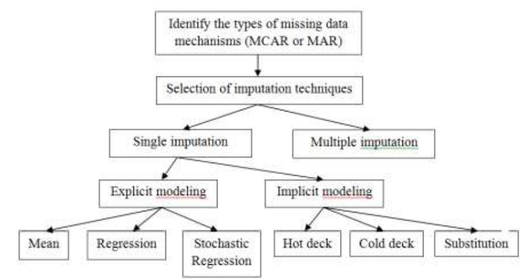</center>


- 결측치 처리 방법
    - 대체
        - 단순 대체(Single Imputation)
            - 평균값, 중앙값 대체: Mean, Median, Mode 등으로 대체(연속형)
            - 최빈값으로 채우기(카테고리형)
            - 가장 마지막에 확인한 값으로 채우기(시계열)
            - 회귀 대체: 관측된 데이터로 1차 회귀선과 ML 알고리즘 등의 예측 모델을 활용하여 예측값을 구하여 결측값 대체(KNN)
            - 확률 모형 값으로 대체: 관측된 값들의 평균과 표준편차를 계산하여 확률 모형의 무작위 결과를 통해서 결측값을 대체
            - Hot deck: 연구중인 자료에서 표본을 바탕으로 비슷한 규칙을 찾아 결측치를 대체
            - Cold Deck: 외부 출처에서 비슷한 연구를 찾아 성향을 찾고 결측치를 대체
            - Substitution: 현재 sample에 포함되지 않은 다른 sample의 값으로 결측치를 대체
            - Datawig 파이썬 라이브러리를 통해 대체
        - 다중 대체(Multiple Imputation)
            - Simple Imputation을 여러번 반복해서 결측값을 계산하고 결측값의 표본을 만듦. 만들어진 표본의 분포를 통해 확률적으로 결측값을 대체
    - 삭제
        - 변수 제거
            - **변수 제거**를 고려할 때 중요한 것은 **변수의 중요도**와 **다른 변수와의 관계성**이다. **1) 상대적으로 중요도가 낮다고 생각**되거나 **2) 해당 변수와 상관관계가 높은, 값이 온전히 보존된 다른 변수가 있다면** 분석에서 결측값이 포함된 변수를 제외하는 방법을 고려해 볼 수 있다. 좀더 쉬운 기준은 **3) 변수에 결측값이 얼마나 포함되었는지 여부**다. 결측값이 차지하는 비중이 절반을 넘어 간다면 크게 고민할 필요없이 변수를 삭제하는 것을 추천한다. (변수에 결측값이 많다는 의미는 대개의 경우 제대로 관리되는 변수가 아니거나 중요도가 낮을 가능성이 높기 때문)
        - 개체 제거(Listwise Deletion)
            - 특정행을 통째로 삭제
            - **개체를 제거**하는 경우는 기준이 조금 다르다. 개체(표본) 수에 비해 **결측치를 가진 개체의 수나 비중이 확연히 적을 경우** 제거를 고려해 볼 수도 있다. (이 기준은 보통 10% 미만 수준에서 논의가 이루어지고 있습니다.)
            - Sample의 수가 적다면 표본 축소로 인한 문제가 발생할 수도 있음
        - 한쌍 제거(Pairwise Deletion)
            - 특정 값을 삭제

<center>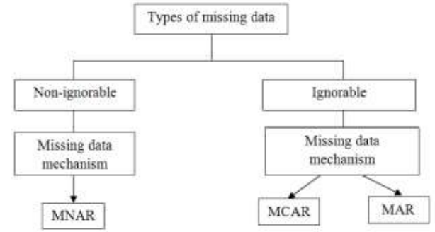</center>


#### Reference

- [7 Ways to Handle Missing Values in Machine Learning](https://towardsdatascience.com/7-ways-to-handle-missing-values-in-machine-learning-1a6326adf79e)
- [결측값 결측치 종류 및 대체 (MCAR MAR MNAR) [빅공남! 통계 같이 공부해요] - 빅공남](https://seeyapangpang.tistory.com/9)
- [클러스터링 분석 - (2) 결측값](https://hweejin.tistory.com/entry/%ED%81%B4%EB%9F%AC%EC%8A%A4%ED%84%B0%EB%A7%81-%EB%B6%84%EC%84%9D-2-%EA%B2%B0%EC%B8%A1%EA%B0%92)
- [Roles of Imputation Methods for Filling the Missing Values: A Review](http://www.aensiweb.com/old/aeb/2013/3861-3869.pdf)

---

### 아웃라이어의 판단하는 기준은 무엇인가요?


>💡 아웃라이어(Outlier)는 데이터 분포를 보았을 때 비정상적인 수치, 분포를 가지고 있는 값을 뜻한다.  
아웃라이어 탐지 방법은 크게 통계적 기법, 시각화, 머신러닝/알고리즘/모델링 등의 분석기법 활용으로 3가지로 나눌 수 있고 탐지 방법에 따라 이상치 기준 또한 다르다.
>  
>이상치를 탐지하는 방법에는 표준편차(ESD), IQR(Interquantile Range), Isolation Forest 등이 있다.


- 통계적 기법
    - ESD(Estreme, Studentized Deviation)
        - 데이터가 정규분포를 따른다고 했을 때 표준편차를 이용해 이상치를 탐지하는 방법이다.
        - 평균에서 좌우로 $3\sigma$보다 더 떨어진 범위를 이상치로 본다
        - Z-score (표준편차, Standard Score, Sigma, Standard Deviation) 라고도 불린다.
    
<center>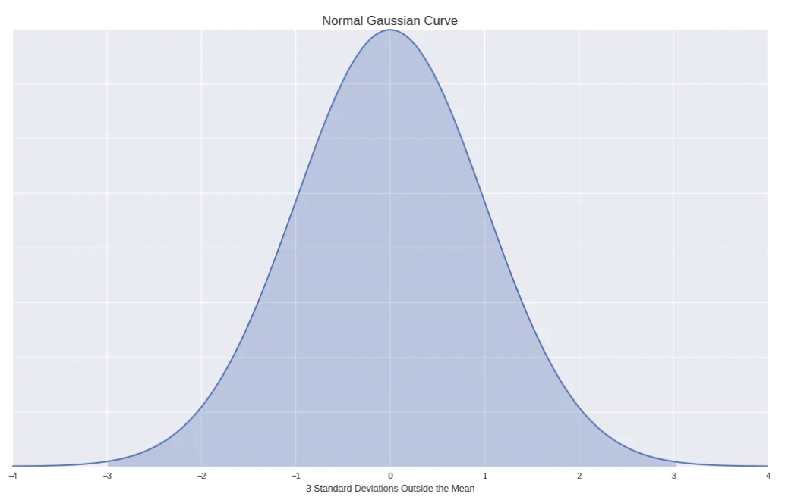</center>
    
```python
def determine_outlier_thresholds_std(dataframe, col_name):
    upper_boundary = dataframe[col_name].mean() + 3 * dataframe[col_name].std()
    lower_boundary = dataframe[col_name].mean() - 3 * dataframe[col_name].std()
    return lower_boundary, upper_boundary
```
    
- 기하평균 활용
    - 기하평균에서 좌우로 $2.5\sigma$만큼 보다 더 떨어진 범위를 이상치로 본다.
- 사분위 편차(IQR(Interquartile Range) with Box plots)
    - 박스플롯을 토대로 기준을 정하게 되고 (Q1 – 1.5 * IQR)보다 작거나 (Q3 + 1.5 * IQR)보다 큰 데이터는 이상치로 처리한다.
    - 분포가 치우친 경우에도 잘 작동한다.
    - IQR 은 Q3(75%) - Q1(25%) 사이에 존재하는 데이터를 의미한다.
    - outlier ≥ Q3 + 1.5*IQR
    - outlier ≤ Q1 - 1.5*IQR
        
```python
def determine_outlier_thresholds_iqr(dataframe, col_name, th1=0.25, th3=0.75):
    quartile1 = dataframe[col_name].quantile(th1)
    quartile3 = dataframe[col_name].quantile(th3)
    iqr = quartile3 - quartile1
    upper_limit = quartile3 + 1.5 * iqr
    lower_limit = quartile1 - 1.5 * iqr
    return lower_limit, upper_limit
```
        
- 시각화를 활용하여 분포를 눈으로 보고 이상치 판별
    - 히스토그램
    - 확률밀도함수
    - Box Plot
- 머신러닝, 알고리즘 모델링 등 분석기법 활용
    - KNN
    - Mahalanobis Distance
    - LOF(Local Outlier Factor)
    - iForest(Isolation Forest)
        - 데이터셋을 결정 트리 형태로 표현해 정상 데이터를 분리하기 위해서는 트리의 깊이가 깊어지고 반대로 이상치는 트리의 상단에서 분리할 수 있다는 개념을 이용한다. 즉, 데이터에서 이상치를 분리하는 것이 더 쉽다는 것이다.

#### Reference

- [Removing Outliers. Understanding How and What behind the Magic.](https://medium.com/analytics-vidhya/removing-outliers-understanding-how-and-what-behind-the-magic-18a78ab480ff)
- [이상값 이상치 Outlier 탐지 [빅공남! 통계 같이 공부해요] - 빅공남](https://seeyapangpang.tistory.com/10)
- [데이터 이상치(Outlier)의 기준은 무엇일까?](https://gannigoing.medium.com/%EB%8D%B0%EC%9D%B4%ED%84%B0-%EC%9D%B4%EC%83%81%EC%B9%98-outlier-%EC%9D%98-%EA%B8%B0%EC%A4%80%EC%9D%80-%EB%AC%B4%EC%97%87%EC%9D%BC%EA%B9%8C-f11f60bf901a)
- [이상치(Outlier) 판단 기준](https://esj205.oopy.io/72782730-23e4-43cf-8799-f3cdcbcb57b9)

---

### 필요한 표본의 크기를 어떻게 계산합니까?


>💡 모집단의 크기(유한, 무한), Z score, 오차한계, 표본비율 등을 이용하여 표본 크기 계산 가능

- 적절한 표본 크기 계산을 위해 필요한 값 **for Statistical Power**
    - 목표하는 Power
    - p value(threshold for significance)
    - effectsize(효과 크기)
        
        $$
        d = {The \, estimated \, difference\, in \, the \, means\over Pooled \, estimated \, standard \, deviations}
        $$
        
- 표본 크기 변수 고려하기
    - 모집단 크기**(N: 모집단의 크기, e: 요구정밀도, P: 모집단의 비율, k: 신뢰수준)**
        - 유한모집단일 때 표본 크기 n은
            
            $$
            n \ge \dfrac {N}{(\dfrac e k)^2 \dfrac {N-1}{P(1-P)}+1}
            $$
            
        - 무한모집단일 때 표본 크기 n은
            
            $$
            n \ge \dfrac {1}{(\dfrac e k)^2 \dfrac {1}{P(1-P)}}
            $$
            
        
        $$
        n = Z^2 \dfrac {\sigma^2}{d^2}\, (Z: \,신뢰수준, \, \sigma: \, 표준편차, \,d: \, 허용오차)
        $$
        
    - 오차 범위
    - 신뢰도
    - 표준편차
- 표본 크기 계산하기
    - Z score 찾기
    - 표본 크기 식 사용하기


#### Reference

- [Power Analysis, Clearly Explained!!!](https://www.youtube.com/watch?t=714&v=VX_M3tIyiYk&feature=youtu.be)
- [올바른 표본 크기를 설정하는 방법](https://www.qualtrics.com/kr/experience-management/research/determine-sample-size/)
- [[R] 추정(estimation) + (표본크기 결정)](https://kerpect.tistory.com/145)
- [모평균의 신뢰구간 표본크기의 결정](https://math100.tistory.com/56)
- [샘플 크기 계산기](https://ko.surveymonkey.com/mp/sample-size-calculator/)

---

### Bias를 통제하는 방법은 무엇입니까?


>💡 모델의 크기를 증가 시키거나 수정 시키는 등의 모델 변경, 오류평가시 얻은 지식을 기반으로 입력 특성 수정, 정규화 축소 및 제거, 학습 데이터 추가 등을 통해 Bias를 통제할 수 있다.

- **Bias 종류 및 통제 방법**
1. 데이터 수집 과정에서 발생한 bias <br>
    : 데이터 수집 과정에서 해당 도메인 지식을 가지고 적합한 feature를 수집해야 함
2. 전처리 과정에서 발생한 bias <br>
    : 데이터 별 적합한 전처리 과정을 진행해야 함(Data Cleaning, 비식별화)
3. Feature Engineering bias <br>
    : 데이터 정규화를 통해 feature간 scale이 조정되어야 함
4. Data selection bias <br>
    : train/test 데이터 셋 분활 과정에서 적절하게 나누어야 함
5. Model Training bias <br>
    : 모델 특성을 고려하여 데이터 셋과 궁합이 맞는 모델을 사용해야 함
6. Model Validation bias <br>
    : 다양한 metric을 고려해서 성능을 평가해야 함(정확도 만으로는 문제가 있을 수 있음)
- **Bias와 Variance의 관계**
    <center>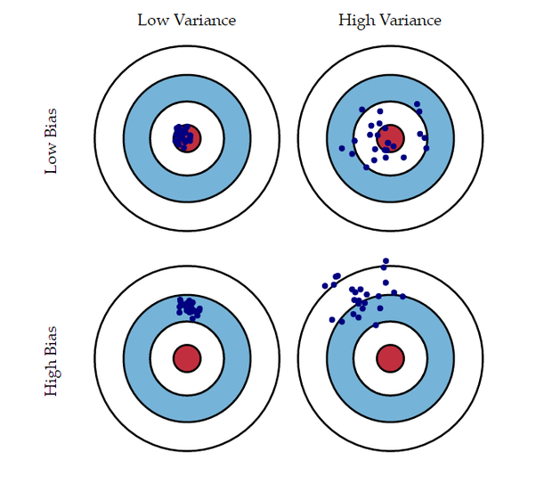</center>
    
    - Low Bias & Low Variance <br>
        : 예측값들이 정답 근방에 분포되어 있고(**bias가 낮음**) 예측값들이 서로 몰려 있습니다. (**variance가 낮음**)
    - Low Bias & High Variance <br>
        : 예측값들이 정답 근방에 분포되어 있으나 (**bias가 낮음**) 예측값들이 서로 흩어져 있습니다. (**variance가 높음**)
    - High Bias & Low Variance <br>
        : 예측값들이 정답에서 떨어져 있고 (**bias가 높음**) 예측값들이 서로 몰려 있습니다. (**variance가 낮음**)
    - High Bias & High Variance <br>
        : 예측값들이 정답에서 떨어져 있고 (**bias가 높음**) 예측값들이 서로 흩어져 있습니다. (**variance가 높음**)


#### Reference

- [How To Reduce Bias in Machine Learning](https://www.spiceworks.com/tech/artificial-intelligence/guest-article/how-to-reduce-bias-in-machine-learning/)
- [[MLY] avoidable bias를 줄이는 방법들](https://talkingaboutme.tistory.com/entry/MLY-avoidable-bias%EB%A5%BC-%EC%A4%84%EC%9D%B4%EB%8A%94-%EB%B0%A9%EB%B2%95%EB%93%A4?category=538748)
- [머신러닝에서의 Bias와 Variance - gaussian37](https://gaussian37.github.io/machine-learning-concept-bias_and_variance/)
- [머신러닝에서 편향(Bias)을 제거하는 6가지 방법](https://blog.naver.com/PostView.nhn?blogId=angryking&logNo=222219949700&categoryNo=21&parentCategoryNo=0&viewDate=&currentPage=1&postListTopCurrentPage=1&from=search)

---

### 로그 함수는 어떤 경우 유용합니까? 사례를 들어 설명해주세요.

>💡 데이터 분석에서 log 함수를 사용하면 데이터의 정규성이 높아지고 회귀 분석에서 정확한 값을 얻을 수 있기 때문에 유용하다. 데이터 간 편차를 줄여, 왜도(skewness, 데이터가 한쪽으로 치우친 정도)와 첨도(kurtosis, 분포가 얼마나 뾰족한지를 나타내는 정도)를 줄일 수 있기 때문에 정규성이 높아진다.
>
>예를 들어 연령 같은 경우 숫자의 범위가 약 0세에서 120세 이하이지만 재산 보유액의 경우에는 0원부터 몇 조에 이르기까지 범위가 매우 넓다. 이런 경우 다음과 같은 이유로 로그함수를 사용한다.
>1. 단위수를 작게 만들어 분석시 정확한 값을 얻기 위해
>2. 독립변수와 종속변수의 변화관계에서 절대량이 아닌 비율을 보기 위해
>3. 비선형관계를 선형으로 만들기 위해


원본 함수와 도함수

$$
함수:a(\theta)=\theta^t(1-\theta)^h\\ 도함수: {d \over d\theta}\theta^t(1-\theta)^h = \theta^{t-1}(1-\theta)^{h-1}[(1-\theta)t - h\theta] \\ 2차\ 도함수: {d^2 \over d\theta^2}\theta^t(1-\theta)^h = (1-\theta)^{h-2}\theta^{t-2}[[(t-1)(1-\theta)-\theta(h-1)][t(1-\theta)-h\theta]-(t+h)\theta(1-\theta)]
$$

로그를 취한 도함수

$$
도함수:{{d}\over{d \theta}}\log(\theta^t(1-\theta)^h) = {t \over \theta} -{h \over 1-\theta}\\ 
2차\ 도함수:{d \over d\theta}({t\over \theta} - {h \over 1-\theta})= -({t\over \theta^2} + {h \over (1-\theta)^2})
$$

#### Reference

- [Why Logarithms Are So Important In Machine Learning](https://towardsdatascience.com/why-logarithms-are-so-important-in-machine-learning-6d2ff7930c8e)
- [데이터 분석 시 식에 로그를 취하는 이유](https://leebaro.tistory.com/entry/%EB%8D%B0%EC%9D%B4%ED%84%B0-%EB%B6%84%EC%84%9D-%EC%8B%9C-%EC%8B%9D%EC%97%90-%EB%A1%9C%EA%B7%B8%EB%A5%BC-%EC%B7%A8%ED%95%98%EB%8A%94-%EC%9D%B4%EC%9C%A0)
- [로그란 무엇인가, 왜 통계에서 로그를 사용하는가? (회귀분석시 자연로그 해석)](https://igija.tistory.com/172)
- [로그함수를 취하는 이유](https://dangdo.tistory.com/44)

---

### 베르누이 분포 / 이항 분포 / 카테고리 분포 / 다항 분포 / 가우시안 정규 분포 / t 분포 / 카이제곱 분포 / F 분포 / 베타 분포 / 감마 분포에 대해 설명해주세요.

- 베르누이 분포
    
    시행 결과를 0, 1로 표현할 수 있는 확률 변수에 대한 분포를 의미한다.

$$
Bern(x;\mu) = \mu^x(1-\mu)^{(1-x)}
$$

- 이항 분포

    성공확률이 μ인 베르누이 시행을 N 번 반복하는 과정에서 N번 중 성공하는 횟수를 X라고 한다면 확률 변수 X에 대한 분포를 의미한다.

$$
Bern(x;N,\mu) = \binom Nx \mu^x(1-\mu)^{(N-x)}
$$

- 카테고리 분포

    베르누이 분포의 확장판으로 1부터 K까지의 K 개의 정수 값 중 하나가 나오는 확률 변수의 분포로 이러한 확률 변수는 1과 0으로 이루어진 다차원 벡터로 변형하여 사용하고 이를 원-핫 인코딩이라고 한다.

$$
Cat(x;\mu)=\mu_1^{x_1}\mu_2^{x_2}...\mu_K^{x_K}
$$

- 다항 분포

    여러 개의 값을 가질 수 있는 독립 확률변수(카테고리 확률변수)들에 대한 확률분포를 말한다. 여러 번의 독립시행에서 각각의 값이 특정 횟수만큼 나타날 확률을 의미한다. 즉, 다항분포에서 n = 1일 때가 카테고리 분포이다.

$$
Cat(x;N,\mu)=\binom Nx \mu_1^{x_1}\mu_2^{x_2}...\mu_K^{x_K}
$$

- 가우시안 정규 분포

    정규분포(normal distribution) 혹은 가우시안 분포(Gaussian distribution)는 연속확률분포의 하나이다. 평균과 분산으로 형상이 결정되며, 주어진 평균과 분산으로 엔트로피를 최대화하는 분포를 의미한다. 중심극한정리에 의하여 독립적인 확률변수들의 평균은 정규분포에 가까워지는 성질이 있기 때문에 수집된 자료의 분포를 근사하는데에 자주 사용된다. 특히 평균이 0이고 표준편차가 1인 정규분포는 표준정규분포(standard normal distribution)이라고 한다.

$$
\mathcal{N}(x;\mu, \sigma^2) = {1\over{\sqrt{2\pi\sigma^2}}}exp(-{x-\mu)^2\over2\sigma^2})
$$

- t 분포

    모집단의 표준편차를 알 수 없을 때 정규분포에서 얻은 N개의 표본으로 계산한 표본평균을 표본표준편차로 정규화한 값의 분포를 의미한다. 표본 평균을 이용하여 정규분포의 평균을 해석할 때와 가설검정(test)와 회귀 분석에 많이 사용된다.

$$
t(x:\mu,\lambda,\nu) = {\sqrt\lambda\over\sqrt{\nu\pi}}{\Gamma({v+1 \over 2})\over \Gamma({v \over 2})}(1+\lambda{(x-\mu)^2\over\nu})^{- {v+1 \over 2}}
$$

- 카이제곱 분포

    카이제곱분포(chi-squared distribution)는 t 분포에서 사용한 p개의 서로 독립적인 표준정규 확률변수를 각각 제곱한 다음 합해서 얻어지는 분포이다. 이 때 p를 자유도라고 하며, 카이제곱분포의 매개변수가 된다. 카이제곱 분포는 신뢰구간이나 가설검정 등의 모델에서 자주 등장한다.

$$
\mathcal{X}^2(x;\nu) = {x^{({\nu\over2}-1)}e^{-{x\over2}}\over2^{\nu \over2}\Gamma({v\over2})}
$$

- F 분포

    F분포는 정규분포를 이루는 모집단에서 독립적으로 추출한 표본들의 분산비율이 나타내는 연속 확률 분포이다. 다시 말하면 카이제곱분포를 따르는 독립적인 두 개의 확률 변수의 표본을 구한 뒤 각각 표본의 수 만큼 나눈 뒤 비율을 구하면 F 분포가 된다. 2개 이상의 표본 평균들이 동일한 모평균을 가진 집단에서 추출되었는지 아니면 서로 다른 모집단에서 추출되는 것인지를 판단하기 위하여 사용된다.

$$
f(x;N_1,N_2) = {\sqrt{(N_1x)^{N_1}N_2^{N_2}\over(N_1x+N_2)^{N_1+N_2}} \over x \Beta({N_1\over2},{N_2\over2})}
$$

- 베타 분포

    0부터 1까지의 값을 가질 수 있는 베르누이분포의 모수 μ의 값을 베이지안 추정한 결과를 표현한 것이다.

    베타함수 - 이항계수를 실수 범위까지 확장한 것
    
    $$
    베타함수: \Beta(\alpha, \beta)= {\Gamma(\alpha)\Gamma(\beta) \over \Gamma(\alpha + \beta)}= \int_0^1 x^{\alpha-1}(1-x)^{\beta-1}dx\ (단, \alpha,\beta>0이다.)
    $$
    


$$
Beta(x;a, b)={\Gamma(\alpha+\beta) \over \Gamma(\alpha)\Gamma(\beta)}x^{\alpha-1}(1-x)^{\beta-1}
$$

- 감마분포

    베타분포가 0부터 1 사잇값을 가지는 모수를 베이지안 방법으로 추정하는 데 사용되는 것과 달리 감마분포는 0부터 무한대의 값을 가지는 양수 값을 추정하는 데 사용되는 분포를 의미한다.

    감마함수 - 팩토리얼 함수를 복소수까지 확장해서 만든 함수
    
    $$
    감마함수: \Gamma(\alpha)=\int_0^\infin x^{\alpha-1}e^{-x}dx
    $$
    


$$
Gam(x;a,b) = {1\over\Gamma(a)}b^ax^{a-1}e^{-bx}
$$

#### Reference

- [8장 사이파이로 공부하는 확률분포 - 데이터 사이언스 스쿨](https://datascienceschool.net/02%20mathematics/08.00%208%EC%9E%A5%20%EC%82%AC%EC%9D%B4%ED%8C%8C%EC%9D%B4%EB%A1%9C%20%EA%B3%B5%EB%B6%80%ED%95%98%EB%8A%94%20%ED%99%95%EB%A5%A0%EB%B6%84%ED%8F%AC.html)
- [로스카츠의 AI 머신러닝 - statistics](https://losskatsu.github.io/categories/#)
- [1st ed., Truth in Engineering](https://blog.naver.com/mykepzzang)

---