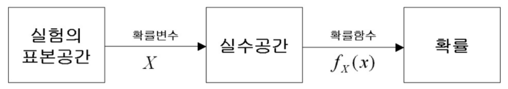

## Problem & Answer

### 고유값(eigen value)와 고유벡터(eigen vector)이 무엇이고 왜 중요한지 설명해주세요.

$n \times n$ 행렬 $A$를 선형변환으로 봤을 때, <b>선형변환 $A$에 의한 변환 결과가 자기 자신의 상수배가 되는 0이 아닌 벡터를 고유벡터라고 하고 이 상수배 값을 고유값</b>이라 한다.   
- 선형변환(Linear Transformation): 선형 결합을 보존하는 두 벡터 공간 사이의 함수   
$T(a+b) = T(a) + T(b), T(ca) = cT(a)$를 만족하는 변환.   
- 아래와 같은 식을 만족하는 열벡터 $v$를 eigen vector, 상수 $\lambda$를 eigen value라 한다.   

$$
Av = \lambda v
$$

- eigen vector, eigen value는 임의의 벡터를 어느 방향으로 변화시켰는지, 변환 과정에서 변화 없이 유지 되는 부분은 어느 부분인지에 대한 정보를 담고 있다.
- 어떤 물체나 영상 등은 수많은 벡터의 뭉치로 볼 수 있는데 eigen vector와 value를 활용해 물체나 영상이 어떤 식으로 변화하는지에 대한 정보를 파악할 수 있게 도와준다.
- 데이터의 특징을 파악할 수 있게 도와주는 SVD(특이값분해), Pseudo-Inverse, 선형연립방정식의 풀이, PCA(주성분분석)에 사용한다.

각 데이터의 Feature 간의 유사도는 모델 학습 결과에 영향을 끼치기 때문에 고유값과 고유벡터를 구해서 완전 독립 관계인 feature를 생성 혹은 추출하는 것이 중요하다.

#### Reference

- [[선형대수학 #3] 고유값과 고유벡터 (eigenvalue & eigenvector)](https://darkpgmr.tistory.com/105)
- [고유값(eigen value)과 고유벡터(eigen vector), 왜 중요한가?](https://kejdev.github.io/machinelearning/2021/01/04/eigen-value-eigen-vecotor.html)
- [eigen vector & eigen value](https://variety82p.tistory.com/entry/eigen-vector-eigenvalue?category=996031)

---

### 샘플링(Sampling)과 리샘플링(Resampling)이 무엇이고 리샘플링의 장점을 말해주세요.

샘플링은 모집단에서 일부만을 뽑아내서 모집단 전체의 경향성을 살펴보고 싶어 사용하는 방법으로 표본추출이라고 한다.
- Sampling 방식
    - Probability Sampling
        - Simple Random Sampling
        - Cluster Sampling(군집 표집)
        - Stratified Sampling(층화 표집)
        - Systematic Sampling(계통 표집)
    - Non-Probability Sampling
        - Convenience Sampling(편의 표본 추출)
        - Judgmental/Purposive Sampling(판단 표본)
        - Snowball/Referral Sampling(눈덩이 표집)
        - Quota Sampling( 할당량 샘플링)
- Sampling 장점
    - 시간과 비용을 줄임
    - 데이터가 정확성
    - 더 많은 모집단에 대한 예측 가능
    - 더 적은 자원으로 진행 가능

하지만 매우 정교한 추출이 이루어져도 모집단과 정확하게 일치할 수는 없으므로 이를 보완하기 위해 샘플링된 데이터에서 부분집합을 뽑아 통계량의 변동성을 확인하는 방법을 사용하는데 이를 리샘플링이라고 한다.
- 대표적인 리샘플링 기법으로는 k-fold 교차검증, bootstrapping 기법이 존재
- k-fold: k-1개의 부분집합들을 훈련 세트로 사용하고 나머지 하나의 부분집합을 테스트 세트로 사용하는 것을 말함
    - k번의 훈련과 테스트를 거쳐 결과의 평균을 구할 수 있음
- bootstrapping
    1. 표본 중 m개를 뽑아 기록하고 다시 제자리에 둔다.
    2. 이를 n번 반복한다.
    3. n번 재표본추출한 값의 평균을 구한다.
    4. 1~3단계를 R번 반복한다.(R: 부트스트랩 반복 횟수)
    5. 평균에 대한 결과 R개를 사용하여 신뢰구간을 구한다.
- 표본을 추출하면서 원래의 데이터셋을 복원하기에 모집단의 분포에 어떤 가정도 필요 없이 표본만으로 추론이 가능

#### Reference

- [샘플링과 리샘플링](https://variety82p.tistory.com/entry/%EC%83%98%ED%94%8C%EB%A7%81%EA%B3%BC-%EB%A6%AC%EC%83%98%ED%94%8C%EB%A7%81?category=996031)
- [DATA - 12. 부트스트랩(Bootstrap)](https://bkshin.tistory.com/entry/DATA-12)
- [샘플링과 리샘플링의 차이는 무엇일까?](https://kejdev.github.io/machinelearning/2021/01/25/sampling-resampling.html)

---

### 확률 모형과 확률 변수는 무엇인가요?

<aside>
💡 확률 변수란 확률로 표현하기 위한 event를 정의하는 것으로 Sample space에서 확률 변수가 취할 수 있는 값에 따라 세 가지로 나뉜다.

</aside>

- 이산확률 변수: 취할 수 있는 값이 정수인 경우
- 연속확률 변수: 취할 수 있는 값이 실수인 경우
- 혼합랜덤 변수: 위의 두 가지 경우가 섞인 경우

확률 분포란 **확률변수의 모든 값과 그에 대응하는 확률들이 어떻게 분포**하고 있는지를 말한다.

이런 변수 성격에 따라 각각이 가지는 확률 함수의 이름도 달라지는데, 이산형은 **확률 질량 함수**라고 하고, 연속형은 **확률 밀도 함수**라고 부른다. 확률함수는 해당 확률 변수가 가진 확률 분포를 나타낸다.

- 확률 함수: 확률 변수를 0과 1 사이의 확률로 mapping하는 것
    - 일반적으로 수학에서 다루는 미지수라 생각하면 됨
    - $P(X=event) = probability$

<aside>
💡 확률 모형이란 확률 변수를 이용하여 데이터 분포를 수학적으로 정의하는 것을 말한다.

</aside>

- 함수에 쓰인 계수들을 모수(parameter)라고 부른다.
- 확률 분포를 안다. → 확률 분포를 나타내는 확률 분포 함수를 안다. → 함수식을 구성하는 모수를 안다.
    - 확률 분포를 알면 확률 변수의 모든 값과 그에 대응하는 확률들을 안다.
    - 모수 추정이 중요한 이유

#### Reference
- [http://www.stat.yale.edu/Courses/1997-98/101/probint.htm](http://www.stat.yale.edu/Courses/1997-98/101/probint.htm)

- [https://ko.wikipedia.org/wiki/확률_변수](https://ko.wikipedia.org/wiki/%ED%99%95%EB%A5%A0_%EB%B3%80%EC%88%98)

- [숨니의 무작정 따라하기 - 확률변수와 확률모형](https://sumniya.tistory.com/24)
- [hanse’s.log - 확률 모형과 확률 변수](https://velog.io/@ohs2251/%ED%99%95%EB%A5%A0-%EB%AA%A8%ED%98%95%EA%B3%BC-%ED%99%95%EB%A5%A0-%EB%B3%80%EC%88%98)
- [Jupyter Community](https://notebook.community/zzsza/Datascience_School/09.%20%EA%B8%B0%EC%B4%88%20%ED%99%95%EB%A5%A0%EB%A1%A02%20-%20%ED%99%95%EB%A5%A0%20%EB%B3%80%EC%88%98/03.%20%ED%99%95%EB%A5%A0%20%EB%AA%A8%ED%98%95%EC%9D%B4%EB%9E%80)

### 누적 분포 함수와 확률 밀도 함수는 무엇인가요? 수식과 함께 표현해주세요.

<aside>
💡 누적분포함수란 확률론에서 주어진 확률 분포가 특정 값보다 작거나 같은 확률을 나타내는 함수

</aside>

확률은 사건(event)이라는 표본의 집합에 대해 할당된 숫자이고 어떤 사건에 어느 정도의 확률이 할당되었는지 묘사한 것을 확률 분포라한다. 확률 분포를 묘사할 때, 모든 사건들을 하나씩 제시하는 것은 어려우므로 확률 변수를 이용한다면 묘사 작업이 간편해진다. 사건(event)이 구간(interval)이 되고 이 구간을 지정하는데 시작점과 끝점이라는 두개의 숫자만 있으면 되기 때문이다. 하지만 이를 정의할 때, 숫자 하나만으로 정의가 가능하도록 시작점을 음수 무한대로 통일하여 확률 분포를 서술할 수 있고, 이를 누적 확률 분포(CDF)라고 한다. 

$$
F(a) = P (X \le a) = \begin{cases}
   \sum_{x \le a} p(x) &\text{if } 이산형 \\
   \int_{-\infty}^a p(x)dx &\text{if } 연속형
\end{cases}
$$

누적 분포 함수는 확률 분포를 함수라는 편리한 상태로 바꾸어 주었고, 확률이 어느 사건에 어느 정도 분포되어 있는지 수학적으로 명확하게 표현해 준다. 그러나 누적 분포 함수는 분포의 형상을 직관적으로 이해하기 어렵다는 단점이 있고, 이를 알기 위해서 확률 변수가 나올 수 있는 전체 구간을 아주 작은 폭을 가지는 구간들로 나눈 다음 각 구간의 확률을 살펴보는 것이 편리하다. 그러나 이 과정에서 구간의 폭을 어느 정도로 정의해야 하는지에 대한 추가적인 약속이 필요하고 이러한 단점을 보완하기 위해 상대적인 확률 분포 형태만을 보도록 만들어진 것이 확률 밀도 함수이다. 누적 확률 분포 그래프 x축의 오른쪽으로 이동하면서 크기의 변화를 살펴보면 특정한 구간에서 확률이 배정되지 않는다면 기울기가 0이고 배정된다면 기울기가 0이 아닐 것이다. 따라서 기울기의 크기를 보면 각 위치에 배정된 확률의 상대적인 크기를 알 수 있고, 기울기의 크기를 구하는 수학적 연산이 미분이므로 확률 밀도 함수는 누적 분포 함수의 미분으로 정의한다. 이러한 이유로 확률밀도함수와 누적분포함수는 미적분의 관계를 가지고 있다.(데이터가 연속형일때만 해당)

$$
\int_{-\infty}^{\infty} f(x)dx = 1\\P(a\le X \le b) = \int_a^b f(x)dx
$$

확률 밀도 함수는 확률 변수 X가 어떤 값 x를 가질 확률을 나타내는 것이 아니라, x 근처에서의 확률 밀도를 나타내는 것이다. 이때, 확률 밀도 함수는 다음과 같은 특성을 가진다.

1. f(x)는 항상 0보다 크거나 같다.
2. X의 값이 특정한 구간 a와 b 사이에 있을 확률은 확률 밀도 함수 f(x)와 a, b 사이의 면적을 구하여 나타낼 수 있다.
3. 확률 밀도 함수의 전체 면적은 1이다.

확률 밀도 함수는 각 확률 변수의 분포마다 다르게 정의된다. 예를 들어, 정규 분포의 확률 밀도 함수는 다음과 같다.

$ f(x) = (1 / (sigma * sqrt(2 * pi))) * exp(-(x - mu)^2 / (2 * sigma^2)) $

여기서 mu는 평균값이며, sigma는 표준 편차이다. 이 함수는 종 모양으로, 평균값을 중심으로 좌우로 대칭이며, 표준 편차가 작을수록 곡선이 좁아진다.

**Reference**
- [https://www.ncl.ac.uk/webtemplate/ask-assets/external/maths-resources/statistics/distribution-functions/cumulative-distribution-function.html](https://www.ncl.ac.uk/webtemplate/ask-assets/external/maths-resources/statistics/distribution-functions/cumulative-distribution-function.html)

- [https://ko.wikipedia.org/wiki/확률_밀도_함수](https://ko.wikipedia.org/wiki/%ED%99%95%EB%A5%A0_%EB%B0%80%EB%8F%84_%ED%95%A8%EC%88%98)
- [https://ko.wikipedia.org/wiki/누적_분포_함수](https://ko.wikipedia.org/wiki/%EB%88%84%EC%A0%81_%EB%B6%84%ED%8F%AC_%ED%95%A8%EC%88%98)

- [notebook community](https://notebook.community/junhwanjang/DataSchool/Lecture/08.%20%EA%B8%B0%EC%B4%88%20%ED%99%95%EB%A5%A0%EB%A1%A0%202%20-%20%ED%99%95%EB%A5%A0%EB%B6%84%ED%8F%AC/4\)%20%EB%88%84%EC%A0%81%20%EB%B6%84%ED%8F%AC%20%ED%95%A8%EC%88%98%EC%99%80%20%ED%99%95%EB%A5%A0%20%EB%B0%80%EB%8F%84%20%ED%95%A8%EC%88%98)
- [[확률/통계] 누적분포함수 (CDF, Cumulative Distribution Function)](https://roytravel.tistory.com/349)
- [확률 분포 함수와 확률 밀도 함수의 의미](https://velog.io/@groovallstar/%ED%99%95%EB%A5%A0-%EB%B6%84%ED%8F%AC-%ED%95%A8%EC%88%98%EC%99%80-%ED%99%95%EB%A5%A0-%EB%B0%80%EB%8F%84-%ED%95%A8%EC%88%98%EC%9D%98-%EC%9D%98%EB%AF%B8)